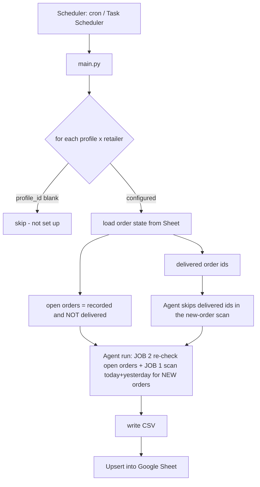
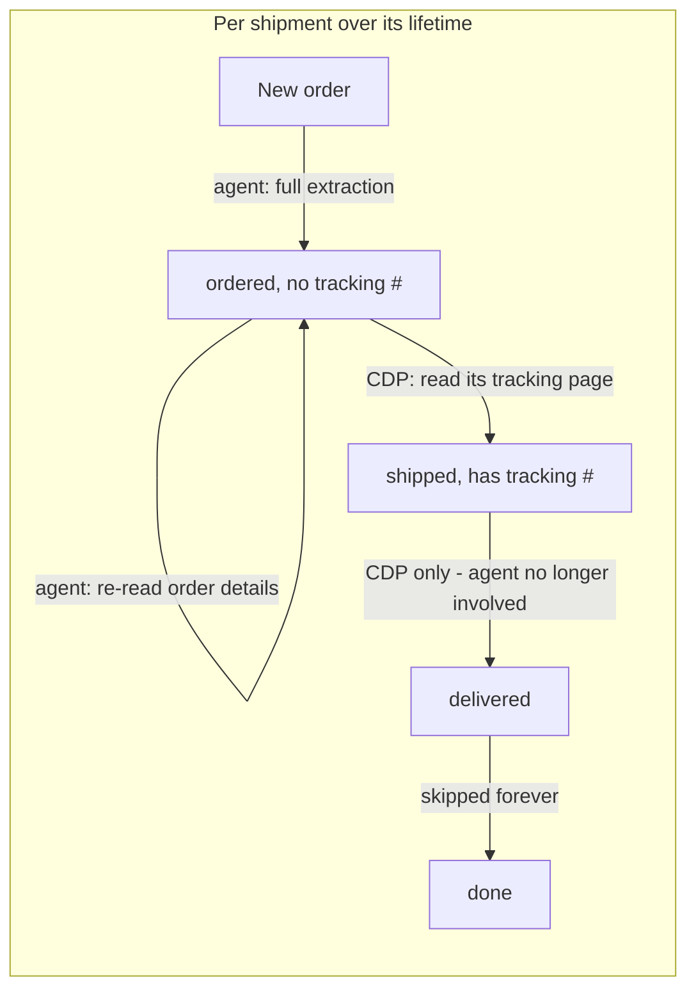

# Buying Group Ledger

Automated order tracking for buying-group reselling. It logs into retailer accounts (Amazon, Amazon
Business, Best Buy, and Costco today; Walmart planned), captures new orders and their shipment status,
and keeps a Google Sheet ledger up to date — cheaply and hands-off.

It runs on **Browser-Use Cloud** (the browser runs in their cloud, not on your machine) and uses a
layered design so the expensive AI agent is only used where it's actually needed.

---

## How it works

Each run makes **one agent call per profile** that does two jobs: scan for **new** orders (JOB 1) and
re-check **already-recorded, not-yet-delivered** orders (JOB 2). Results are upserted into the Sheet.



### Cost model

Browser-Use bills mostly by **input tokens** — every agent step ships the whole page to the model.
Because both jobs share one agent call per profile, more open orders add *steps*, not extra runs.

Work is split by what each tool is actually good at. The **agent** sees *structure* — how many
shipments an order has, which changes when it splits. **CDP + CSS selectors** read a known page
cheaply — the tracking number, which Amazon shows only on a separate tracking page.



- **New-order discovery + first extraction** → agent. A silently-broken selector here would mean a
  *permanently missed order* (missed reimbursement), so adaptability wins.
- **Re-checking whether an order split** → agent, but **only while some shipment still has no
  tracking number**. Amazon splits an order into its final shipments *at ship time*, so once every
  shipment is tracked the structure is settled and the agent stops being asked about that order.
  It re-reads the order-details page only — it never opens tracking pages.
- **Reading tracking numbers and watching for delivery** → CDP + selectors, **per shipment**. A split
  order has one tracking page per shipment; each is read on its own. An empty selector escalates that
  order to the agent rather than being reported as "not shipped".
- **Delivered orders** → skipped entirely; an order counts as delivered only once **every** shipment
  row is delivered.

> **Best Buy and Costco both have a deterministic API primary path** (no agent, no CDP selectors) and
> fall back to the agent only if that path breaks. Costco reads its own GraphQL API with a stored
> token; Best Buy reads its own private order endpoints from inside a logged-in CDP browser (the order
> list from the purchase-history page's embedded data, each order's detail from
> `/profile/ss/api/v1/orders/<id>`). Only Amazon uses the agent/CDP split — it has the "tracking number
> lives on another in-site page" problem, which is exactly what selectors are for.

The next cheaper tier is a **REST tracking API** (17TRACK bills ~$0.024 per shipment *once*, then
status polling is free) to replace the CDP delivery-watch. Gated on confirming it actually covers
Amazon Logistics `TBA…` numbers — test that against the free quota before building it.

### Data model / Sheet columns

One row per line item (its real quantity preserved — a qty-3 line is one row, not three), keyed on
**Order ID + Order Date + Item Name + Shipment** (safe upsert — re-checks update
status/tracking/date/last-scraped **without clobbering** the item name, cost, address, etc.):

Columns are in reading order — identity first, then the money columns left-to-right in the order you
reason about them, then reference/audit columns you rarely scan:

`Order Date · Status · Profile · Retailer · Item Name · Quantity · Order ID · Tracking Number ·
Shipment · Delivery Date · Cost Per Item · Shipping · Total Cost · Card · Cashback Rate ·
Delivery Address · Buying Group · Insurance · Payout Amount · Payout Date · Total Profit ·
Order Link · Tracking Link · Card Last 4 · Last Scraped At`

> **Column order is part of the wire format.** Rows are written to the sheet *positionally* from column
> A, so `FIELDNAMES` (models/order.py) and `HEADER` (sheets/ledger_sync.py) define where every value
> lands. Reordering them without rewriting the rows already on the sheet would silently scramble every
> one of them, so `sync_csv_to_sheet` **refuses to write** to a sheet whose header order doesn't match,
> and `python -m scripts.reorder_sheet --apply` is what conforms an existing sheet to a new order.
> **Adding** a column is the cheap case: append it to both lists and existing rows just gain a trailing
> blank — no migration needed.

**Total Cost is per row** = `Quantity × Cost Per Item` for that shipment line (computed in code, not
trusted from the agent), so the column sums to the order total. **Status** is one of `ordered`,
`shipped`, `delivered`, `cancelled`. `delivered` and `cancelled` are terminal — the order drops out of
future runs. A `cancelled` order is only ever recorded via a re-check (an order first seen as `ordered`
that the order page later shows cancelled); brand-new already-cancelled orders are ignored at discovery.

**Multiple shipments per order:** when an order splits across shipments, each shipment gets its own
row(s) with that shipment's own status, tracking number and delivery date. The **Shipment** column is
part of the key so the *same* product in two different shipments stays on two distinct rows instead of
colliding. Its value is a bare number (`1`, `2`) — the column heading already says "Shipment".

**Every retailer numbers shipments** `1`, `2`, … top-to-bottom, a single shipment
included. Amazon starts an order as one shipment and often **splits it into several when it ships**, so
numbering from the start means the original row updates in place (`1`) and the newly-split
shipments are added as new rows. Best Buy uses the same scheme deliberately: the label is part of the
upsert key, so a label that varies between runs (the page's own wording isn't guaranteed to be stable,
or present) would append a duplicate row instead of updating the existing one.

**Re-check routing.** Both retailers re-check open orders through the **agent**, which re-reads the whole
order-details page and reports every shipment. Amazon can add a shipment (with its own later delivery
date) after an order already looks shipped, so a cached single-page poll would silently miss it.

**Digital items are skipped** on every retailer (gift cards, eBooks, memberships, redemption codes,
etc.) — they're never resold, so they never hit the ledger.

**Profit accounting** (Card through Total Profit) turns the ledger into a P&L rather than just a tracker:

- **Card** and **Cashback Rate** are derived automatically from `Card Last 4`, which the scrapers
  already capture, via a `cards.json` config (see "Card / cashback config" below). Each card has an
  overall rate plus optional **per-retailer overrides**, so a card earning 1.5% generally and 5% at
  Amazon reports the right rate on each row. A card that isn't configured keeps a blank name — so the
  gap stays visible — but still gets your `DEFAULT_CASHBACK_RATE` so profit stays computable. The rate
  is the only cashback column; the dollar amount isn't stored, it's folded into Total Profit.
- **Insurance**, **Payout Date** and **Payout Amount** are yours to fill in (the BFMR / MaxOutDeals
  integration will populate them later). The scrapers always write them blank, and the upsert's
  blank-never-overwrites rule is what stops a re-scrape from wiping what you typed.
- **Total Profit** is a **live Google Sheets formula**, not a scraped number:

  ```
  Total Profit = Payout Amount + Cashback − Total Cost − Shipping − Insurance
  Cashback     = (Total Cost + Shipping) × Cashback Rate
  ```

  It's a formula so it recalculates the instant you type an Insurance or Payout Amount — a value
  computed at scrape time would go stale immediately, and a `delivered` row is terminal and never
  re-scraped, so it would stay stale forever. The cell reads blank (not `0`) until Payout Amount is
  filled, so un-paid-out rows don't drag a column sum down with fake losses.

  **Shipping is allocated pro-rata across an order's rows** (`Shipping × this row's Total Cost ÷ the
  order's Total Cost`). Every retailer reports one *order-level* shipping total and repeats it on every
  row, so charging it per row would bill a 3-row order for shipping three times over and make the
  column's sum wrong. Pro-rata makes the column sum to exactly one shipping charge per order.

**Buying Group** classifies each row's `Delivery Address`: which buying group's warehouse the order
shipped to, or `Unclassified` when the address matches no configured warehouse. It's derived at run time
from a `warehouses.json` config (see "Warehouse / jig config" below), so it also sets up the later
buying-group tracking-post step. **Personal orders are dropped entirely** — an address matched to a group
named `Personal` (your own reship/consumer addresses) never reaches the sheet. `Unclassified` is
deliberately *not* treated as personal: a real warehouse you simply haven't configured yet is kept and
counted (in the run log) rather than silently disappearing. A blank address on a partial re-check leaves
the tag untouched.

---

## Concepts

- **Profile** = a Browser-Use cloud browser identity (`profiles.json`) with its own **static ISP
  proxy** and the set of **retailers** it's logged into. One profile can cover several retailers.
- **Sheet** = the source of truth. Each run reads it to decide what's new vs. what needs a re-check,
  and writes results back.
- **Alerts** = email (Gmail SMTP) + Discord webhook, fired on logged-out sessions and run failures.

---

## Install

Requires Python 3.11+ and a Browser-Use Cloud account with the **Dev tier** (custom proxies need a
paid plan).

```bash
# 1. dependencies
python -m venv .venv
# Windows:  .venv\Scripts\pip install -r requirements.txt
# Linux:    .venv/bin/pip install -r requirements.txt

# 2. config
cp .env.example .env          # then fill it in (see below)
cp profiles.example.json profiles.json
cp warehouses.example.json warehouses.json   # optional: buying-group address classification
cp cards.example.json cards.json             # optional: card names + per-card cashback rates
```

**`.env`** — fill in:
- `BROWSER_USE_API_KEY` (cloud.browser-use.com), `BROWSER_USE_LLM` (default `gpt-5.6-luna`)
- `GOOGLE_SERVICE_ACCOUNT_FILE` (path to the JSON key), `GOOGLE_SHEET_ID`, `GOOGLE_SHEET_WORKSHEET_NAME`
- `GMAIL_ADDRESS` + `GMAIL_APP_PASSWORD`, `ALERT_EMAIL_TO`, `DISCORD_WEBHOOK_URL`
- `LOOKBACK_DAYS` (default 1 = today + yesterday), `BROWSER_USE_MAX_COST_USD` (per-run cost cap)
- `DEFAULT_CASHBACK_RATE` — the cashback rate of last resort, applied when a row's card isn't in
  `cards.json` at all. A decimal fraction (`0.02` = 2%); `"2%"` also works. A bare `2` is rejected
  rather than guessed at.

**Google Sheet** — create a Google Cloud service account, download its JSON key to
`service_account.json`, and **share the sheet** with the service account's `…@…iam.gserviceaccount.com`
email as Editor. Put the sheet ID (from its URL) in `GOOGLE_SHEET_ID`.

**Test alerts** before relying on them:
```bash
.venv/bin/python -m alerts.notifier      # Windows: .venv\Scripts\python -m alerts.notifier
```

### Set up a profile (log in through its proxy)

Fill a profile's `proxy` in `profiles.json` (leave `profile_id` blank), then:

```bash
.venv/bin/python -m scripts.create_profile --label profile-1
# add a retailer to an existing profile later:
.venv/bin/python -m scripts.create_profile --label profile-1 --add-retailer walmart
```

It opens a live browser URL — log into the retailer(s) there, press Enter, and it saves the
`profile_id` back into `profiles.json`. Re-run it any time to log back in if a session expires.

**Auto-auth for Best Buy (Sign in with Google).** Best Buy web sessions die in ~20–25 min, which
would break hands-off scheduling. To let the agent log itself back in, give the profile an `auth`
block keyed by retailer and log into Gmail in the same `create_profile` session:

```json
"auth": { "bestbuy": { "method": "google", "google_email": "you@gmail.com" } }
```

The agent then clicks "Continue with Google" whenever it hits the Best Buy sign-in page, riding the
profile's long-lived Google session — no Best Buy password or 2FA/TOTP is stored (passkeys aren't
usable: Browser-Use's cloud agent has no WebAuthn support). Verify once that "Sign in with Google"
lands in the Best Buy account holding your orders. If the Google session is *also* dead, the agent
reports logged-out and alerts, as before. Without an `auth` block, a profile behaves the same as
before (reports logged-out, doesn't log in).

**Password + 2FA fallback** (for accounts not linked to Google):

```json
"auth": { "bestbuy": { "method": "password", "username": "you@example.com",
                       "password": "…", "totp_secret": "BASE32SEED" } }
```

The agent enters the credentials and, if 2-step verification is requested, computes the current
authenticator code **in the browser at that moment** (Web Crypto — a code baked into the prompt would
be expired by the time the agent reaches the field). `totp_secret` is the base32 seed shown when you
set up the authenticator app; it only covers authenticator-app 2FA, not SMS/email codes. ⚠️ Because
Browser-Use v4 has no secret-injection channel, the password **and** the TOTP secret go into the
agent's task prompt and Browser-Use's cloud run history — so `method: "google"` (no stored secret) is
preferred where the account supports it.

### Tests

```bash
.venv/bin/pip install -r requirements-dev.txt
.venv/bin/python -m pytest            # Windows: .venv\Scripts\python -m pytest
```

Fully offline and free — no credentials, no network, no Browser-Use run. They cover the parts that
fail *silently* rather than loudly: column drift between `FIELDNAMES`/`HEADER` (rows are written
positionally, so drift misaligns every row), the blank-preserving upsert, the delivered rollup, agent
JSON parsing, status normalization, and prompt instructions that data integrity depends on. Behavior
that only a real page can prove — selector accuracy, whether an order actually splits — still needs a
live run.

---

## Running

```bash
# all retailers x all configured profiles:
.venv/bin/python main.py            # Windows: .venv\Scripts\python main.py

# a specific retailer:
.venv/bin/python main.py amazon
.venv/bin/python main.py amazon-business
.venv/bin/python main.py bestbuy
.venv/bin/python main.py costco
```

> Best Buy uses a deterministic primary path like Costco (no agent): a CDP browser holds the profile's
> logged-in cookie, discovers order ids from the purchase-history page's embedded data, and reads each
> order's detail from Best Buy's own `/profile/ss/api/v1/orders/<id>` endpoint via an in-page fetch —
> tracking numbers, per-item cost, card, and native shipment grouping all come structured. If that path
> fails (login, page shape, network) it falls back to the Browser-Use agent automatically (and alerts).
> **Costco is similar**: it reads orders from Costco's
> private GraphQL API using a stored refresh token — no browser and no agent — and tracks **online
> shipped orders only** (in-warehouse pickups and Same-Day/Instacart grocery are skipped). If that API
> ever fails, Costco falls back to the agent automatically (and alerts). See "Costco API setup" below.
> **Amazon and Amazon Business** also have a deterministic primary path (no order JSON exists, so a CDP
> browser parses the order-details HTML and reads each shipment's tracking number off Amazon's own
> package-tracking page), with the Browser-Use agent as the automatic fallback. Amazon Business is a
> separate scraper (`retailer_key` `amazon-business`) that shares Amazon's tracking page but has its own
> order-history discovery + pagination; keep the two Amazon accounts on separate profiles.

### Costco API setup (one-time)

Costco's primary path uses its private GraphQL API instead of a browser, so it needs a **refresh
token** grabbed once from a logged-in browser session (it's long-lived; redo only if revoked):

1. Log into `costco.com`, open DevTools → Application → Local Storage → `https://signin.costco.com`,
   and copy the `secret` of the key whose name contains `refreshtoken`.
2. Save it against the profile that owns this membership (847 covers all US warehouses):
   ```bash
   python -m scripts.costco_token --label profile-2 --token "<REFRESH_TOKEN>" --warehouses 847
   ```
   (There's also a best-effort `--grab` that reads the token from a logged-in profile over CDP, but
   Costco encrypts its stored token, so the manual `--token` copy above is the reliable path.)

The token is written to `.costco/<label>.json` (gitignored — treat it like a password). This path
also needs the extra deps in `requirements.txt` (`curl_cffi`, `PyJWT`); re-run the pip install if you
set the project up before Costco was added. If the token is missing/expired or the API changes shape,
Costco alerts and falls back to the Browser-Use agent for that run.

Profiles with a blank `profile_id` are skipped. Output goes to `data/orders_*.csv` and the Sheet;
logs to `logs/run.log`. A lock (`logs/.run.lock`, auto-expires after 3h) prevents overlapping runs.

### Warehouse / jig config (the "Buying Group" column)

To classify each order by which buying group's warehouse it shipped to, create a **`warehouses.json`**
at the repo root (gitignored — it holds real addresses). Copy `warehouses.example.json` and edit it:

```json
[
  { "buying_group": "BFMR",
    "jigs": [
      { "label": "BFMR-A", "street": "123 Main St", "zip": "10001", "name_contains": "c/o BFMR" },
      { "label": "BFMR-B", "street": "500 Warehouse Blvd", "zip": "07004" }
    ] },
  { "buying_group": "Personal",
    "jigs": [ { "label": "home", "zip": "94103", "name_contains": "Test Buyer" } ] }
]
```

Each buying group lists one or more **jigs** — the address variants it routes packages through. A jig
matches an order when **every** substring field it sets (`street` / `zip` / `name_contains`, or a generic
`contains: [...]` list) appears in the delivery address after normalization (lowercased, punctuation and
extra spaces removed — so "c/o" vs "c o" and "Ste." vs "Ste" don't matter). The first matching jig (in
file order) wins and its `buying_group` is written to the row.

- List your own reship address under a group literally named **`Personal`** — those orders are **dropped
  from the sheet entirely** (never recorded). List every personal address you use, or the order will fall
  through to `Unclassified` and still show.
- An address matching **no** jig is tagged **`Unclassified`** (kept, not dropped), and the run logs how
  many — a real warehouse you forgot to add stands out instead of silently vanishing. A jig with no match
  fields is rejected (it would match everything).
- No `warehouses.json` at all = every non-blank address is `Unclassified` (nothing is guessed).
- Editing the file re-tags **open** orders on the next run (they get re-read); already-delivered rows
  keep their tag. Classification is offline and free — no live run is needed to change it.

### Card / cashback config (the "Card" and "Cashback Rate" columns)

Every scraper already captures the last 4 digits of the card an order was charged to. Create a
**`cards.json`** at the repo root (gitignored — it names your cards) to turn those digits into a card
name and a cashback rate. Copy `cards.example.json`:

```json
[
  { "last4": "4321", "name": "Chase Freedom Unlimited", "cashback_rate": 0.015,
    "retailer_rates": { "Amazon": "5%", "Best Buy": "3%" } },
  { "last4": "8765", "name": "Citi Double Cash", "cashback_rate": "2%" },
  { "last4": "1111", "name": "Amex Business Platinum",
    "retailer_rates": { "Amazon Business": "5%" } },
  { "last4": "1111", "name": "Personal Amex Gold", "cashback_rate": "4%", "profile": "profile-1" }
]
```

**Each card gets an overall rate plus optional per-retailer overrides**, because a card's earn rate is
category-dependent in practice. The rate for a row resolves in three tiers, most specific first:

1. the card's **`retailer_rates`** entry for that row's retailer — this card, at this store
2. the card's **`cashback_rate`** — its overall rate everywhere else
3. **`DEFAULT_CASHBACK_RATE`** from `.env` — for cards you haven't configured at all

Details:

- Rates are **decimal fractions** (`0.015` = 1.5%); `"1.5%"` is accepted and converted, in both
  `cashback_rate` and `retailer_rates`. A bare `2` is **rejected** rather than guessed at — it reads
  equally as 2% or 200%, and picking wrong would misstate every profit number by 100×.
- `retailer_rates` keys are matched loosely: `"Best Buy"`, `"bestbuy"` and `"best-buy"` are the same
  key. A key that names **no** retailer this ledger scrapes logs a warning at load — a typo'd override
  would otherwise never apply and nothing would say so.
- `last4` is matched **normalized**, so it doesn't matter that Amazon says "ending in 4321", Best Buy
  sends `************4321`, and Costco sends `xxxx4321`.
- Two *different* cards can genuinely share a last 4 across accounts. Add an optional **`profile`** (a
  `profiles.json` label) to scope an entry; the scoped entry wins over the catch-all, and genuinely
  ambiguous duplicates log a warning rather than one being silently picked. (There's no `retailer`
  scope — one physical card is used at many retailers, and what varies per retailer is the *rate*.)
- A card that's charged but **not configured** gets a blank Card name (so the gap is visible, and a
  name you type by hand survives) and the default rate. No `cards.json` at all = every row gets the
  default rate and no name.
- Like the warehouse config, this is offline and free — editing it re-derives the columns for **open**
  orders on the next run. Delivered rows are terminal and keep what they were tagged with.

### Automatic running (~4×/day, 6h apart — adjustable)

**Linux (cron):**
```bash
./scripts/install_cron.sh          # every 6h -> 00:00 / 06:00 / 12:00 / 18:00
./scripts/install_cron.sh 4        # every 4h (re-run with any interval to change it)
```

**Windows (Task Scheduler)** — elevated PowerShell:
```powershell
powershell -NoProfile -ExecutionPolicy Bypass -File scripts\install_task_windows.ps1 -Hours 6
```

Both call the platform runner (`run.sh` / `run.ps1`), which `cd`s to the project root and appends to
`logs/cron.log`. To watch a run live on Linux: `tail -f logs/cron.log` (or `screen -S ledger ./run.sh`).

---

## Docker (portable / multi-instance)

Because the browser runs in Browser-Use Cloud, the image is lightweight (no Chromium — the bundled
Playwright is only a CDP *client*). The container **self-schedules** via supercronic, so no host cron
is needed. Best for Linux servers, cloud, or running several isolated instances; for a single desktop
the venv + Task Scheduler path is simpler.

Prereqs on the host: `.env`, `service_account.json`, and `profiles.json` present in the project dir
(they're mounted/injected at runtime and are excluded from the image via `.dockerignore` — secrets are
never baked in). If you use Costco, also have `.costco/<label>.json` present — it's mounted read-only so
the container can use the GraphQL API path; without it, Costco falls back to the agent every run. (Not
using Costco? Drop the `./.costco` volume line from `docker-compose.yml`.)

`warehouses.json` and `cards.json` are mounted the same way. Both are optional, **but a bind mount
whose host file is missing makes Docker create an empty directory in its place** — so either create the
file (even as `[]`) or delete that volume line. Without them the run still works: every address tags
`Unclassified` and every card falls back to `DEFAULT_CASHBACK_RATE`.

```bash
docker compose up -d --build      # build + start; runs every RUN_INTERVAL_HOURS
docker compose logs -f            # watch runs
docker compose down               # stop
```

Adjust the schedule in `docker-compose.yml` (`RUN_INTERVAL_HOURS`, default 6 = 4x/day). Set
`RUN_ON_START: "true"` to also run once at container start, and `TZ` to align the schedule to local
time. To run **multiple instances**, copy the compose service with a different `profiles.json`/`.env`
mounted per instance (e.g. one per proxy pool).

---

## Moving to another machine

Everything except the local environment is cloud-side (profiles, sheet, proxies), so migration is just:
copy the project **except** `.venv/`, `__pycache__/`, `data/`, `logs/`; be sure to bring the gitignored
`.env`, `service_account.json`, `profiles.json`, and (if you use them) `warehouses.json` / `cards.json`
— the first three hold live credentials, so move them securely;
then recreate the venv (`python -m venv .venv && …/pip install -r requirements.txt`) and re-install the
scheduler on the new host. No re-login or re-sharing needed.

---

## Roadmap / TODO

**Next up**

- **BFMR + MaxOutDeals integration.** `buying_groups/bfmr.py` and `maxoutdeals.py` are placeholders with
  guessed endpoints and payload shapes — they need real API docs, keys, and auth. Then build
  `sync_tracking.py`: read the ledger for rows that have a tracking number but aren't posted yet, match
  by Order ID, POST the tracking to each platform, and mark the row posted. The **Insurance**,
  **Payout Date** and **Payout Amount** columns already exist for this step to fill — they're
  hand-entered until then, and Total Profit picks them up automatically either way.
- **Event-driven re-checks from retailer emails.** Ingest Amazon / Best Buy shipped + delivered +
  order-update emails (Gmail API or IMAP) to trigger a targeted re-check of just that order, instead of
  or alongside the 6-hour poll. Faster status, fewer wasted agent runs.

**Needs live validation**

- **Best Buy deterministic path over time** — the ss-api primary path is live-validated end-to-end
  (discovery, detail fetch, mapping all correct on a real account), but only on a warm session and the
  order states captured so far. Still worth watching: a cold scheduled run that must log itself back in,
  and the agent fallback firing on a real API outage.
- **Costco split lifecycle across runs** — the API path and agent fallback are both live-validated
  end-to-end (discovery, detail fetch, mapping, and the agent extracting a real 2-shipment order all
  match). Still worth watching over time: an order observed while still *unshipped* transitioning to
  shipped/split on a later run, and the refresh-token rotation surviving many days of scheduled runs.
- **The Amazon split lifecycle** — a single-shipment order, an agent re-check that catches the
  ship-time split, shipment `1` updating in place while `2`/`3` append, and the order staying
  open until every shipment is delivered.

**Open questions / smaller items**

- `delivery_date`: the prompts ask for `YYYY-MM-DD`, but the dormant CDP path writes the raw promise
  text ("Arriving Monday") into the same field. No live exposure while that path stays disabled —
  revisit only if it's ever re-enabled.
- More retailers: Walmart. (Amazon Business is built — see the retailer list above.)
- Optional delivery-watch cost optimization: revive the dormant CDP fast-path, or use a REST tracking
  API (17TRACK / TrackingMore) — verify Amazon Logistics TBA coverage before committing to one.
  Currently shelved: reliability beat the saving once already.

**Known wrinkle.** A *legacy* Amazon row written before the Shipment column existed (blank shipment)
will orphan once if that order later splits: the scraper emits `1`… and the blank row goes stale
and stays perpetually open. Only affects pre-migration rows; clear the test sheet if it shows up.

**Recently done.** Offline test suite (`pytest`); `sync_csv_to_sheet` now derives its row from
`FIELDNAMES` instead of a second hand-maintained copy, with a drift guard test; `status` is normalized
to the known vocabulary (unknown values log a warning and fall back to `ordered` rather than aborting
the run); Best Buy numbers shipments like Amazon instead of copying page wording; both prompts show a
trimmed JOB 2 example so re-checks don't re-fill identity fields.

---

## Project layout

```
main.py                 orchestration + run lock
config/settings.py      .env-backed settings
config/profiles.py      profiles.json loader + Sheet order-state reader
config/warehouses.py    warehouses.json loader + address -> buying-group classifier
config/cards.py         cards.json loader + card last-4 -> card name/cashback-rate resolver
models/                 OrderItem + ProfileConfig + Warehouse/Jig + Card schemas
scrapers/base.py        scrape(): CDP re-check + agent scan + merge/cleanup
scrapers/amazon.py      Amazon prompt + tracking-page selectors/reader
scrapers/bestbuy.py     Best Buy: ss-api primary path + agent-fallback prompt (deterministic login)
scrapers/bestbuy_api.py Best Buy client: CDP login + purchase-history flight discovery + ss-api fetch
scrapers/bestbuy_mapping.py  pure ss-api payload -> OrderItem rows (offline-tested)
scripts/bestbuy_capture.py   dev recon tool that captured the Best Buy endpoints/fixtures
scrapers/cdp.py         Playwright-over-CDP browser helper (deterministic reads)
sheets/ledger_sync.py   Google Sheet upsert (safe partial refresh) + order-state loader
output/csv_writer.py    per-run CSV
alerts/notifier.py      email + Discord alerts
buying_groups/          BFMR / MaxOutDeals API clients (placeholders)
tests/                  offline pytest suite (no credentials/network needed)
run.sh / run.ps1        scheduler entry points
scripts/                create_profile, install_cron, install_task_windows
Dockerfile / docker-compose.yml / docker/entrypoint.sh   containerized, self-scheduling
```
