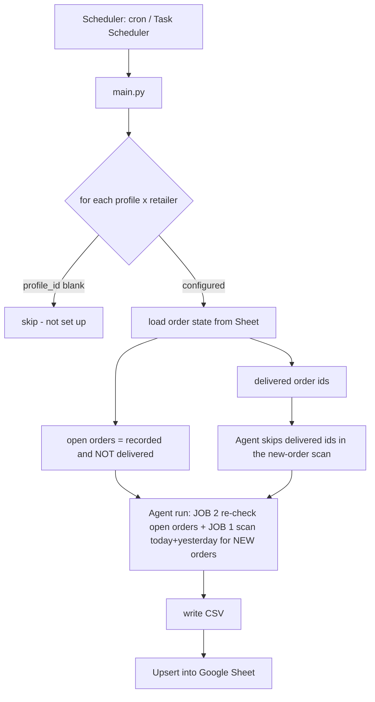
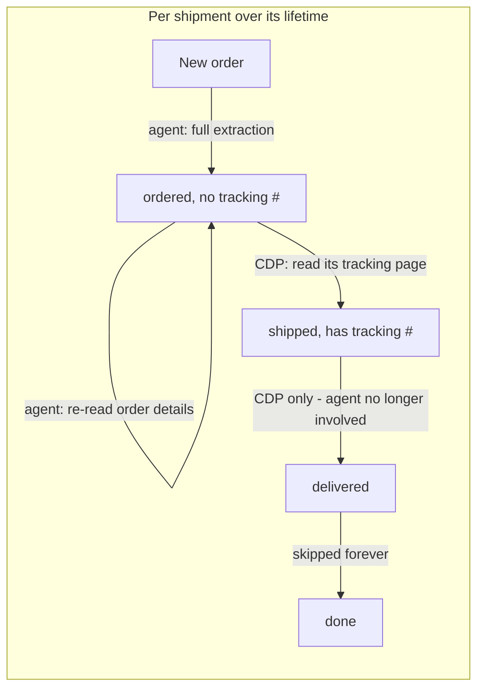

# Buying Group Ledger

Automated order tracking for buying-group reselling. It logs into retailer accounts (Amazon, Amazon
Business, Best Buy, and Costco today; Walmart planned), captures new orders and their shipment status,
and keeps a Google Sheet ledger up to date — cheaply and hands-off.

It runs on **Browser-Use Cloud** (the browser runs in their cloud, not on your machine) and uses a
layered design so the expensive AI agent is only used where it's actually needed.

---

## How it works

Each run makes **one agent call per profile** that does two jobs: scan for **new** orders (JOB 1) and
re-check **already-recorded, not-yet-delivered** orders (JOB 2). Results are upserted into the Sheet.



### Cost model

Browser-Use bills mostly by **input tokens** — every agent step ships the whole page to the model.
Because both jobs share one agent call per profile, more open orders add *steps*, not extra runs.

Work is split by what each tool is actually good at. The **agent** sees *structure* — how many
shipments an order has, which changes when it splits. **CDP + CSS selectors** read a known page
cheaply — the tracking number, which Amazon shows only on a separate tracking page.



- **New-order discovery + first extraction** → agent. A silently-broken selector here would mean a
  *permanently missed order* (missed reimbursement), so adaptability wins.
- **Re-checking whether an order split** → agent, but **only while some shipment still has no
  tracking number**. Amazon splits an order into its final shipments *at ship time*, so once every
  shipment is tracked the structure is settled and the agent stops being asked about that order.
  It re-reads the order-details page only — it never opens tracking pages.
- **Reading tracking numbers and watching for delivery** → CDP + selectors, **per shipment**. A split
  order has one tracking page per shipment; each is read on its own. An empty selector escalates that
  order to the agent rather than being reported as "not shipped".
- **Delivered orders** → skipped entirely; an order counts as delivered only once **every** shipment
  row is delivered.

> **Best Buy and Costco both have a deterministic API primary path** (no agent, no CDP selectors) and
> fall back to the agent only if that path breaks. Costco reads its own GraphQL API with a stored
> token; Best Buy reads its own private order endpoints from inside a logged-in CDP browser (the order
> list from the purchase-history page's embedded data, each order's detail from
> `/profile/ss/api/v1/orders/<id>`). Only Amazon uses the agent/CDP split — it has the "tracking number
> lives on another in-site page" problem, which is exactly what selectors are for.

The next cheaper tier is a **REST tracking API** (17TRACK bills ~$0.024 per shipment *once*, then
status polling is free) to replace the CDP delivery-watch. Gated on confirming it actually covers
Amazon Logistics `TBA…` numbers — test that against the free quota before building it.

### Data model / Sheet columns

One row per line item (its real quantity preserved — a qty-3 line is one row, not three), keyed on
**Order ID + Order Date + Item Name + Shipment** (safe upsert — re-checks update
status/tracking/date/last-scraped **without clobbering** the item name, cost, address, etc.):

Columns are in reading order — identity first, then the money columns left-to-right in the order you
reason about them, then reference/audit columns you rarely scan:

`Order Date · Status · Profile · Retailer · Item Name · Quantity · Order ID · Tracking Number ·
Shipment · Delivery Date · Cost Per Item · Shipping · Total Cost · Card · Cashback Rate ·
Insurance · Payout Amount · Payout Date · Total Profit · Buying Group ·
Order Link · Tracking Link · Delivery Address · Card Last 4 · Last Scraped At ·
Tracking Submitted`

> **Column order is part of the wire format.** Rows are written to the sheet *positionally* from column
> A, so `FIELDNAMES` (models/order.py) and `HEADER` (sheets/ledger_sync.py) define where every value
> lands. Reordering them without rewriting the rows already on the sheet would silently scramble every
> one of them, so `sync_csv_to_sheet` **refuses to write** to a sheet whose header order doesn't match,
> and `python -m scripts.reorder_sheet --apply` is what conforms an existing sheet to a new order.
> **Adding** a column is the cheap case: append it to both lists and existing rows just gain a trailing
> blank — no migration needed.

**Rows are kept newest-first** (Order Date descending, then Order ID, then Shipment ascending — so a
multi-shipment order's rows stay adjacent and in shipment order). New rows are still *written* at the
bottom and the sheet is re-sorted afterwards, which is deliberate: the sync caches each matched row's
number from its pre-sync snapshot and writes updates to that row, so moving rows mid-sync would put
every update on the wrong one. Sorting only runs when a sync actually **appended** — an update rewrites
a row where it already sits and can't change the order — so a routine re-check run skips it. Use
`python -m scripts.sort_ledger` (dry run, then `--apply`) to sort by hand if the order ever drifts.

**Adding a row by hand** works, with two rules. Give it a real **Order ID** — the sort covers the whole
block from row 2 to the last row that has one, and a row without one is invisible to the upsert forever
(every future re-check appends beside it rather than updating it). And enter **Order Date as text** —
typing `2026-08-12` makes Sheets store a real Date, which changes the upsert key and duplicates the row
on its next re-check; type `'2026-08-12`, or format the column as plain text first. Get both right and
the row is indistinguishable from a scraped one: it sorts into place and gets its Total Profit formula
on the next append-triggered sort (`scripts/sort_ledger.py --apply` if you don't want to wait). Don't
hand-write **Total Profit** — it's position-bound and re-stamped on every sort. **Insurance** is yours
to fill in and is never overwritten by anything. **Payout Amount** and **Payout Date** are hand-entered
too, but the buying-group sync fills them in once the group pays (it never blanks a cell it has no
figure for, so a value you typed only changes if the group reports a different one). A note or spacer row belongs *below* the last order, where the sort leaves it alone; put one
inside the block and it gets shuffled in among the orders. `scripts/audit_sheet.py` flags all of this.

**Status** is one of `ordered`, `shipped`, `delivered`, `cancelled`, `paid`, `return`. The first two are
the live lifecycle the scrapers maintain; the other four are **terminal** — the order drops out of
future runs. `paid` and `return` come from the **buying group**, not the retailer (see "Buying
groups" below): BFMR reports both, MOD confirms `paid` by listing a package as received but has no
return signal, so a MOD return is typed in by hand. A status only ever moves forward, so that
hand-typed `return` survives every later run. Anything outside this vocabulary keeps the order **open forever**, so it
gets re-read on every run indefinitely — which on an agent retailer is a recurring cost on an order
that is already finished. `audit_sheet`'s `column_shape` fails an unknown status for exactly that
reason.

> **Only ever hand-import FINISHED orders** — `delivered`, `paid`, `return`, `cancelled`. Never import
> `ordered` or `shipped` rows. A single run already keeps those current: the scrapers discover open
> orders and re-check them to delivery on their own, so importing them by hand duplicates work the
> ledger does for free, and any detail you get slightly wrong (a re-worded item name, a different
> shipment number) becomes a duplicate row the next run appends beside yours. Terminal rows are the
> safe class precisely because nothing will ever re-read them — they're history, and no scraper will
> fight you over them.

### Bulk-importing history by hand

Pasting a batch of finished orders straight into the sheet is fine, and in one way safer than routing
them through `sync_csv_to_sheet`: a paste doesn't go through the upsert, so a mistake can't silently
overwrite an existing row. Errors just sit there as rows, and the audit names them.

**Before you paste — format `Order Date`, `Delivery Date` and `Payout Date` as Plain text.** This is the
one hard-to-undo step, because a Date-typed `Order Date` changes the row's upsert key. Convert to
`YYYY-MM-DD` while you're there.

Then, per row:

| Column | What to put in it |
|---|---|
| `Cost Per Item` | `Total Cost ÷ Quantity` — `total_cost_matches_quantity` fails if it doesn't reconcile |
| `Cashback Rate` | the **total** rate earned, as one number. If your source tracks base and bonus rates in separate columns, add them together |
| `Insurance` | a **positive** cost. The profit formula subtracts it |
| `Shipment` | `1`, unless one order has two rows with the **same item name** — then number them by tracking number, `1` and `2`, or they collide on one upsert key |
| `Shipping` | `0` if your costs are already all-in |
| `Total Profit` | nothing — it's a formula, re-stamped on every sort |

Leave `Profile`, `Order Link`, `Tracking Link`, `Delivery Address`, `Card Last 4` and `Last Scraped At`
blank if you don't have them; none of it is read for a terminal row. Fill `Card` and `Cashback Rate`
directly, since `Card` is normally *derived* from `Card Last 4` and that only happens during a scrape.

Finish with `python -m scripts.sort_ledger --apply`, then `python -m scripts.audit_sheet`.

**What the audit will and won't catch.** It's a strong net for *mechanical* errors — Date-typed cells,
duplicate keys, `Cost Per Item` not reconciling, text in numeric columns, embedded newlines, blank
Order IDs, unknown statuses, non-integer Shipment. All FAIL-level, all named with a row number.

It is blind to *semantic* ones. `cashback_rate_sane` only checks that a rate is plausible, so **1%
where you meant 13.5% passes silently**, as does a negative Insurance. So verify those two by
arithmetic instead: after pasting, compare the sheet's computed `Total Profit` against the profit your
old records show, on two or three rows chosen to cover each rate structure you use. If those agree to
the cent, the rate and sign mapping is right everywhere. It takes two minutes and it's the only check
that proves the numbers rather than the shapes.

**Total Cost is per row** = `Quantity × Cost Per Item` for that shipment line (computed in code, not
trusted from the agent), so the column sums to the order total. A `cancelled` order is only ever
recorded via a re-check (an order first seen as `ordered` that the order page later shows cancelled);
brand-new already-cancelled orders are ignored at discovery.

**Multiple shipments per order:** when an order splits across shipments, each shipment gets its own
row(s) with that shipment's own status, tracking number and delivery date. The **Shipment** column is
part of the key so the *same* product in two different shipments stays on two distinct rows instead of
colliding. Its value is a bare number (`1`, `2`) — the column heading already says "Shipment".

**Every retailer numbers shipments** `1`, `2`, … top-to-bottom, a single shipment
included. Amazon starts an order as one shipment and often **splits it into several when it ships**, so
numbering from the start means the original row updates in place (`1`) and the newly-split
shipments are added as new rows. Best Buy uses the same scheme deliberately: the label is part of the
upsert key, so a label that varies between runs (the page's own wording isn't guaranteed to be stable,
or present) would append a duplicate row instead of updating the existing one.

**Re-check routing.** Both retailers re-check open orders through the **agent**, which re-reads the whole
order-details page and reports every shipment. Amazon can add a shipment (with its own later delivery
date) after an order already looks shipped, so a cached single-page poll would silently miss it.

**Digital items are skipped** on every retailer (gift cards, eBooks, memberships, redemption codes,
etc.) — they're never resold, so they never hit the ledger.

**Profit accounting** (Card through Total Profit) turns the ledger into a P&L rather than just a tracker:

- **Card** and **Cashback Rate** are derived automatically from `Card Last 4`, which the scrapers
  already capture, via a `cards.json` config (see "Card / cashback config" below). Each card has an
  overall rate plus optional **per-retailer overrides**, so a card earning 1.5% generally and 5% at
  Amazon reports the right rate on each row. A card that isn't configured keeps a blank name — so the
  gap stays visible — but still gets your `DEFAULT_CASHBACK_RATE` so profit stays computable. The rate
  is the only cashback column; the dollar amount isn't stored, it's folded into Total Profit.
- **Insurance**, **Payout Date** and **Payout Amount** are filled by the buying-group sync (see
  "Buying groups" below) — or by hand until you enable it. The scrapers always write them blank, and
  the upsert's blank-never-overwrites rule is what stops a re-scrape from wiping what you typed.
- **Total Profit** is a **live Google Sheets formula**, not a scraped number:

  ```
  Total Profit = Payout Amount + Cashback − Total Cost − Shipping − Insurance
  Cashback     = (Total Cost + Shipping) × Cashback Rate
  ```

  It's a formula so it recalculates the instant you type an Insurance or Payout Amount — a value
  computed at scrape time would go stale immediately, and a `delivered` row is terminal and never
  re-scraped, so it would stay stale forever. The cell reads blank (not `0`) until Payout Amount is
  filled, so un-paid-out rows don't drag a column sum down with fake losses.

  **Shipping is allocated pro-rata across an order's rows** (`Shipping × this row's Total Cost ÷ the
  order's Total Cost`). Every retailer reports one *order-level* shipping total and repeats it on every
  row, so charging it per row would bill a 3-row order for shipping three times over and make the
  column's sum wrong. Pro-rata makes the column sum to exactly one shipping charge per order.

**Buying Group** classifies each row's `Delivery Address`: which buying group's warehouse the order
shipped to, or `Unclassified` when the address matches no configured warehouse. It's derived at run time
from a `warehouses.json` config (see "Warehouse / jig config" below), so it also sets up the later
buying-group tracking-post step. **Personal orders are dropped entirely** — an address matched to a group
named `Personal` (your own reship/consumer addresses) never reaches the sheet. `Unclassified` is
deliberately *not* treated as personal: a real warehouse you simply haven't configured yet is kept and
counted (in the run log) rather than silently disappearing. A blank address on a partial re-check leaves
the tag untouched.

---

## Concepts

- **Profile** = a Browser-Use cloud browser identity (`profiles.json`) with its own **static ISP
  proxy** and the set of **retailers** it's logged into. One profile can cover several retailers.
- **Sheet** = the source of truth. Each run reads it to decide what's new vs. what needs a re-check,
  and writes results back.
- **Alerts** = email (Gmail SMTP) + Discord webhook, fired on logged-out sessions and run failures.

---

## Install

Requires Python 3.11+ and a Browser-Use Cloud account with the **Dev tier** (custom proxies need a
paid plan).

```bash
# 1. dependencies
python -m venv .venv
# Windows:  .venv\Scripts\pip install -r requirements.txt
# Linux:    .venv/bin/pip install -r requirements.txt

# 2. config
cp .env.example .env          # then fill it in (see below)
cp profiles.example.json profiles.json
cp warehouses.example.json warehouses.json   # optional: buying-group address classification
cp cards.example.json cards.json             # optional: card names + per-card cashback rates
```

**`.env`** — fill in:
- `BROWSER_USE_API_KEY` (cloud.browser-use.com), `BROWSER_USE_LLM` (default `gpt-5.6-luna`)
- `GOOGLE_SERVICE_ACCOUNT_FILE` (path to the JSON key), `GOOGLE_SHEET_ID`, `GOOGLE_SHEET_WORKSHEET_NAME`
- `GMAIL_ADDRESS` + `GMAIL_APP_PASSWORD`, `ALERT_EMAIL_TO`, `DISCORD_WEBHOOK_URL`
- `LOOKBACK_DAYS` (default 1 = today + yesterday), `BROWSER_USE_MAX_COST_USD` (per-run cost cap)
- `DEFAULT_CASHBACK_RATE` — the cashback rate of last resort, applied when a row's card isn't in
  `cards.json` at all. A decimal fraction (`0.02` = 2%); `"2%"` also works. A bare `2` is rejected
  rather than guessed at.

**Google Sheet** — create a Google Cloud service account, download its JSON key to
`service_account.json`, and **share the sheet** with the service account's `…@…iam.gserviceaccount.com`
email as Editor. Put the sheet ID (from its URL) in `GOOGLE_SHEET_ID`.

**Test alerts** before relying on them:
```bash
.venv/bin/python -m alerts.notifier      # Windows: .venv\Scripts\python -m alerts.notifier
```

### Set up a profile (log in through its proxy)

Fill a profile's `proxy` in `profiles.json` (leave `profile_id` blank), then:

```bash
.venv/bin/python -m scripts.create_profile --label profile-1
# add a retailer to an existing profile later:
.venv/bin/python -m scripts.create_profile --label profile-1 --add-retailer walmart
```

It opens a live browser URL — log into the retailer(s) there, press Enter, and it saves the
`profile_id` back into `profiles.json`. Re-run it any time to log back in if a session expires.

**Auto-auth for Best Buy (username + password).** Best Buy web sessions die in ~20–25 min, which
would break hands-off scheduling, so give the profile an `auth` block and both Best Buy paths log
themselves back in:

```json
"auth": { "bestbuy": { "method": "password", "username": "you@example.com", "password": "…" } }
```

> ⚠️ **Turn 2-step verification OFF on the Best Buy account** (Account Settings → Sign-in &
> Security). Nothing here can answer a challenge. If it's on, sign-in stops at the challenge screen,
> the run alerts as logged out, and no orders are read.

`password` is the only supported method. Google SSO, Apple and authenticator-app TOTP were removed in
2026-08-13: each was a second login path that had to keep working, exercised only when a session
happened to die, so a break in one surfaced days later as a mystery logout. Passkeys were never
usable — Browser-Use's cloud agent has no WebAuthn support.

Where the password goes depends on which path runs:

- the **deterministic path** (normal case) types it into a CDP browser on your machine — it builds no
  prompt, so the password never leaves the host;
- the **agent fallback** puts it in the task prompt, because Browser-Use v4 has no secret-injection
  channel — so it's visible to the LLM and kept in the cloud run history.

Without an `auth` block a profile just reports logged-out and alerts, without trying to log in.

### Tests

```bash
.venv/bin/pip install -r requirements-dev.txt
.venv/bin/python -m pytest            # Windows: .venv\Scripts\python -m pytest
```

Fully offline and free — no credentials, no network, no Browser-Use run. They cover the parts that
fail *silently* rather than loudly: column drift between `FIELDNAMES`/`HEADER` (rows are written
positionally, so drift misaligns every row), the blank-preserving upsert, the delivered rollup, agent
JSON parsing, status normalization, and prompt instructions that data integrity depends on. Behavior
that only a real page can prove — selector accuracy, whether an order actually splits — still needs a
live run.

### Auditing the sheet

`pytest` proves the *code* is right; it can't see the live sheet. `scripts/audit_sheet.py` checks the
sheet itself against every invariant the ledger depends on, and **writes nothing, ever** (it
authenticates with a read-only scope, so it isn't merely well-behaved — it isn't permitted to write):

```bash
.venv/bin/python -m scripts.audit_sheet                  # Windows: .venv\Scripts\python -m ...
.venv/bin/python -m scripts.audit_sheet --expect-rows 23 # also assert the row count
```

It's worth running **before and after** a live run — the diff is what proves a run updated rows
instead of duplicating them, and `--compare` does that for you:

```bash
.venv/bin/python -m scripts.audit_sheet --save-snapshot before.json
.venv/bin/python main.py
.venv/bin/python -m scripts.audit_sheet --compare before.json
```

That reports added / removed / changed rows keyed on the upsert key, so a run that appended a
genuinely new order is immediately distinguishable from one that duplicated an existing row.
(`Last Scraped At` is ignored — it changes on every touch and would otherwise mark every row as
changed.) Exit code is `0` when nothing failed, `1` on a failure (or on a warning under `--strict`),
so it can gate a scheduled run.

What it checks, and why each one matters: the header matches `HEADER` **exactly** (right names in the
wrong order is the one failure that scrambles every row with no error — see the column-order warning
above); no duplicate upsert keys, on all three of the keys `sync_csv_to_sheet` uses; every row's
`Total Profit` still holds the *live formula* rather than a number frozen from a past read, and that
formula still points at the current columns; and that the cell **types** are intact — `Shipment` an
int, `Card Last 4` text with its leading zeros, the money columns numeric rather than `"$1,299.00"`
text, and the date columns plain ISO text.

That last one is the one to care about. **`Order Date` is part of the upsert key**, so if the date
columns are ever re-formatted as real Dates, a row without a tracking number will append a duplicate
on its next re-check. A more general check catches the same class of bug for any key column: it
builds each row's key twice — once from the displayed text and once from the stored value — and
fails if they differ, i.e. if a row's identity depends on how you happen to have formatted it.

It also checks the things that go wrong *around* the data rather than in it: content outside the
25-column block (a stray note below the data misplaces the next appended row), `#REF!` errors left by
a deleted column, a cashback rate outside 0–1, merged cells (they blank their neighbours on read), and
**open orders that stopped being re-scraped** — the failure nobody notices, whether that's an order
stuck open forever or the scheduler silently not running. Tune that last one with `--stale-days`.

Two flags make it free to iterate on: `--save-snapshot FILE` dumps the raw sheet, and
`--from-snapshot FILE` re-audits that dump offline with no credentials and no API calls. `--json`
emits the same results machine-readably, `--compare` included.

---

## Running

```bash
# all retailers x all configured profiles:
.venv/bin/python main.py            # Windows: .venv\Scripts\python main.py

# a specific retailer:
.venv/bin/python main.py amazon
.venv/bin/python main.py amazon-business
.venv/bin/python main.py bestbuy
.venv/bin/python main.py costco
```

> Best Buy uses a deterministic primary path like Costco (no agent): a CDP browser holds the profile's
> logged-in cookie, discovers order ids from the purchase-history page's embedded data, and reads each
> order's detail from Best Buy's own `/profile/ss/api/v1/orders/<id>` endpoint via an in-page fetch —
> tracking numbers, per-item cost, card, and native shipment grouping all come structured. If that path
> fails (login, page shape, network) it falls back to the Browser-Use agent automatically (and alerts).
> **Costco is similar**: it reads orders from Costco's
> private GraphQL API using a stored refresh token — no browser and no agent — and tracks **online
> shipped orders only** (in-warehouse pickups and Same-Day/Instacart grocery are skipped). If that API
> ever fails, Costco falls back to the agent automatically (and alerts). See "Costco API setup" below.
> **Amazon and Amazon Business** also have a deterministic primary path (no order JSON exists, so a CDP
> browser parses the order-details HTML and reads each shipment's tracking number off Amazon's own
> package-tracking page), with the Browser-Use agent as the automatic fallback. Amazon Business is a
> separate scraper (`retailer_key` `amazon-business`) that shares Amazon's tracking page but has its own
> order-history discovery + pagination; keep the two Amazon accounts on separate profiles.

### Costco API setup (one-time)

Costco's primary path uses its private GraphQL API instead of a browser, so it needs a **refresh
token** grabbed once from a logged-in browser session (it's long-lived; redo only if revoked):

1. Log into `costco.com`, open DevTools → Application → Local Storage → `https://signin.costco.com`,
   and copy the `secret` of the key whose name contains `refreshtoken`.
2. Save it against the profile that owns this membership (847 covers all US warehouses):
   ```bash
   python -m scripts.costco_token --label profile-2 --token "<REFRESH_TOKEN>" --warehouses 847
   ```
   (There's also a best-effort `--grab` that reads the token from a logged-in profile over CDP, but
   Costco encrypts its stored token, so the manual `--token` copy above is the reliable path.)

The token is written to `.costco/<label>.json` (gitignored — treat it like a password). This path
also needs the extra deps in `requirements.txt` (`curl_cffi`, `PyJWT`); re-run the pip install if you
set the project up before Costco was added. If the token is missing/expired or the API changes shape,
Costco alerts and falls back to the Browser-Use agent for that run.

Profiles with a blank `profile_id` are skipped. Output goes to `data/orders_*.csv` and the Sheet;
logs to `logs/run.log`. A lock (`logs/.run.lock`, auto-expires after 3h) prevents overlapping runs.

### Warehouse / jig config (the "Buying Group" column)

To classify each order by which buying group's warehouse it shipped to, create a **`warehouses.json`**
at the repo root (gitignored — it holds real addresses). Copy `warehouses.example.json` and edit it:

```json
[
  { "buying_group": "BFMR",
    "jigs": [
      { "label": "BFMR-A", "street": "123 Main St", "zip": "10001", "name_contains": "c/o BFMR" },
      { "label": "BFMR-B", "street": "500 Warehouse Blvd", "zip": "07004" }
    ] },
  { "buying_group": "Personal",
    "jigs": [ { "label": "home", "zip": "94103", "name_contains": "Test Buyer" } ] }
]
```

Each buying group lists one or more **jigs** — the address variants it routes packages through. A jig
matches an order when **every** substring field it sets (`street` / `zip` / `name_contains`, or a generic
`contains: [...]` list) appears in the delivery address after normalization (lowercased, punctuation and
extra spaces removed — so "c/o" vs "c o" and "Ste." vs "Ste" don't matter). The first matching jig (in
file order) wins and its `buying_group` is written to the row.

- List your own reship address under a group literally named **`Personal`** — those orders are **dropped
  from the sheet entirely** (never recorded). List every personal address you use, or the order will fall
  through to `Unclassified` and still show.
- An address matching **no** jig is tagged **`Unclassified`** (kept, not dropped), and the run logs how
  many — a real warehouse you forgot to add stands out instead of silently vanishing. A jig with no match
  fields is rejected (it would match everything).
- No `warehouses.json` at all = every non-blank address is `Unclassified` (nothing is guessed).
- Editing the file re-tags **open** orders on the next run (they get re-read); already-delivered rows
  keep their tag. Classification is offline and free — no live run is needed to change it.

### Card / cashback config (the "Card" and "Cashback Rate" columns)

Every scraper already captures the last 4 digits of the card an order was charged to. Create a
**`cards.json`** at the repo root (gitignored — it names your cards) to turn those digits into a card
name and a cashback rate. Copy `cards.example.json`:

```json
[
  { "last4": "4321", "name": "Chase Freedom Unlimited", "cashback_rate": 0.015,
    "retailer_rates": { "Amazon": "5%", "Best Buy": "3%" } },
  { "last4": "8765", "name": "Citi Double Cash", "cashback_rate": "2%" },
  { "last4": "1111", "name": "Amex Business Platinum",
    "retailer_rates": { "Amazon Business": "5%" } },
  { "last4": "1111", "name": "Personal Amex Gold", "cashback_rate": "4%", "profile": "profile-1" }
]
```

**Each card gets an overall rate plus optional per-retailer overrides**, because a card's earn rate is
category-dependent in practice. The rate for a row resolves in three tiers, most specific first:

1. the card's **`retailer_rates`** entry for that row's retailer — this card, at this store
2. the card's **`cashback_rate`** — its overall rate everywhere else
3. **`DEFAULT_CASHBACK_RATE`** from `.env` — for cards you haven't configured at all

Details:

- Rates are **decimal fractions** (`0.015` = 1.5%); `"1.5%"` is accepted and converted, in both
  `cashback_rate` and `retailer_rates`. A bare `2` is **rejected** rather than guessed at — it reads
  equally as 2% or 200%, and picking wrong would misstate every profit number by 100×.
- `retailer_rates` keys are matched loosely: `"Best Buy"`, `"bestbuy"` and `"best-buy"` are the same
  key. A key that names **no** retailer this ledger scrapes logs a warning at load — a typo'd override
  would otherwise never apply and nothing would say so.
- `last4` is matched **normalized**, so it doesn't matter that Amazon says "ending in 4321", Best Buy
  sends `************4321`, and Costco sends `xxxx4321`.
- Two *different* cards can genuinely share a last 4 across accounts. Add an optional **`profile`** (a
  `profiles.json` label) to scope an entry; the scoped entry wins over the catch-all, and genuinely
  ambiguous duplicates log a warning rather than one being silently picked. (There's no `retailer`
  scope — one physical card is used at many retailers, and what varies per retailer is the *rate*.)
- A card that's charged but **not configured** gets a blank Card name (so the gap is visible, and a
  name you type by hand survives) and the default rate. No `cards.json` at all = every row gets the
  default rate and no name.
- Like the warehouse config, this is offline and free — editing it re-derives the columns for **open**
  orders on the next run. Delivered rows are terminal and keep what they were tagged with.

### Buying groups (posting tracking numbers, and reading payouts back)

Scraping tells you what you bought. The buying group is who pays you for it — so `sync_tracking.py`
posts each shipped package's tracking number to the right group, and reads their payout back into the
**Insurance**, **Payout Amount** and **Payout Date** columns, which is what makes **Total Profit**
light up (the formula stays blank until Payout Amount is filled).

Two groups are supported today, and they work nothing alike:

| | **BFMR** | **MaxOutDeals** |
|---|---|---|
| auth | `API-KEY` + `API-SECRET` headers | bearer token **+ an IP allowlist** |
| keyed on | its own reservation → purchase → shipment ids | the tracking number |
| batching | one object per ledger row | one object per package (rows summed) |
| limits | undocumented | **10/day** payouts, **30/day** tracking |

```bash
# .env
BFMR_API_KEY=...           # both from Developer Tools in your BFMR account settings
BFMR_API_SECRET=...
BFMR_MIN_INSURANCE_VALUE=0 # 0 = insure every shipment
MAXOUTDEALS_API_KEY=...    # MOD also needs the account id + email it wants in every request body
MAXOUTDEALS_USER_ID=...
MAXOUTDEALS_EMAIL=...
```

⚠️ **MaxOutDeals rejects any call from an unregistered IP**, however valid your token. Add the machine
that runs this under the **firewall tab** in your MOD profile — and again if you move hosts, change
ISP, or containerize it.

```bash
python -m scripts.bg_probe          # read-only recon; answers the open API questions
python -m sync_tracking             # DRY RUN — shows exactly what it would send. Sends nothing.
python -m sync_tracking --apply --limit 1     # one package per group, for the first live test
python -m sync_tracking --void 1Z999...       # undo a BFMR insurance filing
```

**Routing is the Buying Group column**, which is already derived from the delivery address (see
"Warehouse / jig config"). A row goes to exactly one group. `Personal` orders never reach the sheet,
and `Unclassified` rows are **skipped and counted** rather than posted to a guess — an unconfigured
warehouse is a real warehouse, and sending someone else's package to the wrong group is worse than
leaving it visible.

**There's no "posted at" column, deliberately.** Whether a number has been submitted is something the
group knows and the sheet doesn't: MOD ignores duplicates by contract, and BFMR has a status
endpoint, so each run asks rather than keeping a local copy that drifts the moment a write fails or
you paste something into their dashboard by hand.

**A payout is split pro-rata** across the rows sharing a tracking number, for the same reason
order-level shipping is — a box holding two items is two rows, and writing the whole payout to each
would book it twice.

**Status advances to `paid` or `return`.** Those are the two outcomes a retailer can never tell you
about, so the buying group is the authority on them:

- **BFMR reports both directly** — its tracker carries `paid` and `returned` per package.
- **MaxOutDeals confirms payment by listing a package in its received-items report**; there is no
  finer signal. ⚠️ **MOD gives no return signal at all**, so a returned MOD package will keep reading
  `paid` until you set its Status to `return` on the sheet **by hand**. That correction is safe: a
  status only ever moves forward, so later runs won't undo it.
- Everything earlier in the journey (`shipped`, `delivered`) stays the retailer's to report — if both
  sources wrote it, they'd overwrite each other every run.

**A payout is only written once the group has actually paid.** An unpaid package leaves the cell
blank rather than writing `0` — Total Profit reads a blank as "not paid out yet", but a literal zero
would make it compute a large fictitious loss.

**`Tracking Submitted`** is a checkbox: ticked when the buying group holds that package's tracking
number. Format the column as a checkbox in Sheets and it renders as a tick — the values are real
booleans. It's for reading, not for deciding: what's already been submitted is still re-derived from
the group on every run, so a failed sheet write can't strand a package. An unticked box next to a
shipped row is the thing worth noticing. Boxes are never cleared automatically.

**Insurance** is filled from the group's own premium line. A package that's been paid out and shows
no premium records a real `0`; one still in transit is left blank, since the premium may not be
posted yet. An inferred `0` never overwrites a figure you typed yourself.

**BFMR insurance is filed automatically** when enabled. It never declares a package value (BFMR works
it out from the shipment, so there's no way to over-declare and overpay), never files twice, and only
covers shipments worth at least `BFMR_MIN_INSURANCE_VALUE`. The **premium** is read back into the
Insurance column and the **gross** payout into Payout Amount — rather than netting the two — so the
deduction is visible rather than silently shrinking your payout. MOD never charges a premium, so its
rows record a real `0`.

> **Best Buy sometimes ships several orders in one carton** under a single tracking number. BFMR
> allows a number once, so the second order is rejected and
> [asks you to append B/C/D](https://support.bfmr.com/hc/en-us/articles/50968170907547) until it's
> accepted — their record then reads `529900000009B` where your ledger reads `529900000009`.
>
> You get an **ACTION NEEDED** alert naming the three manual steps: add the tracking by hand (with
> the order number on it), **file the insurance by hand**, and raise a support ticket with proof of
> purchase. The tool won't do any of them for you — until the tracking exists, BFMR has no shipment
> to insure, and an automatic filing would post against nothing while reporting success.
>
> There's nothing to edit on the sheet. The next run finds whichever letter you used, ticks
> Tracking Submitted, and fills in the payout, premium and status as they arrive.

Once you've done a dry run and a one-package live test, set `BUYING_GROUP_SYNC_ENABLED=1` to let the
scheduled run do it too — it's off by default because it spends real money unattended.

### Automatic running (~4×/day, 6h apart — adjustable)

**Linux (cron):**
```bash
./scripts/install_cron.sh          # every 6h -> 00:00 / 06:00 / 12:00 / 18:00
./scripts/install_cron.sh 4        # every 4h (re-run with any interval to change it)
```

**Windows (Task Scheduler)** — elevated PowerShell:
```powershell
powershell -NoProfile -ExecutionPolicy Bypass -File scripts\install_task_windows.ps1 -Hours 6
```

Both call the platform runner (`run.sh` / `run.ps1`), which `cd`s to the project root and appends to
`logs/cron.log`. To watch a run live on Linux: `tail -f logs/cron.log`, or run it inside
`tmux new -s ledger` so it survives your SSH session dropping (detach with `Ctrl-B D`, reattach with
`tmux attach -t ledger`).

**Both runners behave identically**, so a host is diagnosable the same way whichever platform it's
on. They rotate `logs/cron.log` at 10 MB — left unbounded it fills a small disk months later, long
after anyone is watching — and always record how a run *ended*, including its exit code. They also
stamp `logs/.last_run`, the same heartbeat the container healthcheck uses: if that file is stale, the
scheduler has stopped firing, which is otherwise a completely silent failure. Check it with
`cat logs/.last_run`, and cross-check the data side with
`python -m scripts.audit_sheet --stale-days 2`.

**Before trusting either scheduler on a new machine, run `python -m scripts.preflight`** — it's
offline and free, and it catches the misconfigurations that keep working while doing the wrong thing
(see the Docker section below). For a dedicated Linux host — an Ubuntu VM or a Raspberry Pi — follow
**[DEPLOY.md](DEPLOY.md)**.

---

## Docker (portable / multi-instance)

Because the browser runs in Browser-Use Cloud, the image is lightweight (no Chromium — the bundled
Playwright is only a CDP *client*). The container **self-schedules** via supercronic, so no host cron
is needed. Best for Linux servers, cloud, or running several isolated instances; for a single desktop
the venv + Task Scheduler path is simpler.

Prereqs on the host: `.env`, `service_account.json`, and `profiles.json` present in the project dir
(they're mounted/injected at runtime and are excluded from the image via `.dockerignore` — secrets are
never baked in). If you use Costco, also have `.costco/<label>.json` present — it's mounted read-only so
the container can use the GraphQL API path; without it, Costco falls back to the agent every run. (Not
using Costco? Drop the `./.costco` volume line from `docker-compose.yml`.)

`warehouses.json` and `cards.json` are mounted the same way. Both are optional, **but a bind mount
whose host file is missing makes Docker create an empty directory in its place** — so either create the
file (even as `[]`) or delete that volume line. Without them the run still works: every address tags
`Unclassified` and every card falls back to `DEFAULT_CASHBACK_RATE`.

```bash
docker compose up -d --build      # build + start; runs every RUN_INTERVAL_HOURS
docker compose logs -f            # watch runs
docker compose down               # stop
```

Adjust the schedule in `docker-compose.yml` (`RUN_INTERVAL_HOURS`, default 6 = 4x/day). Set
`RUN_ON_START: "true"` to also run once at container start, and `TZ` to align the schedule to local
time. To run **multiple instances**, copy the compose service with a different `profiles.json`/`.env`
mounted per instance (e.g. one per proxy pool).

The image builds for the host's own architecture (amd64 and arm64 both work — see
**[DEPLOY.md](DEPLOY.md)** for the server runbook), and smoke-tests its scheduler binary during the
build so a wrong-architecture image fails loudly at build time rather than crash-looping later.

**Two things run automatically that are worth knowing about:**

- **Preflight, on every container start.** `scripts/preflight.py` checks the things that otherwise
  fail *silently* — a deterministic-path dependency that would degrade three retailers to the paid
  agent without raising, a bind mount whose missing host file became an empty directory, a missing
  Costco token. It **alerts and continues** rather than aborting, because a container that refuses to
  start also stops scraping; set `PREFLIGHT_STRICT: "true"` to fail fast instead. Run it by hand any
  time — it's offline and free:
  ```bash
  docker compose run --rm --entrypoint python ledger -m scripts.preflight
  ```
- **A heartbeat + healthcheck.** `docker ps` reporting "Up 3 weeks" proves the scheduler process is
  alive, not that it ever ran anything — a wedged lock or a failing job leaves the container happily
  "Up" while the ledger goes stale. Every completed run stamps `logs/.last_run`, and the container
  reports `(unhealthy)` once that's older than two intervals.

Container logs are capped (10 MB × 5) rather than left to Docker's unbounded default, which otherwise
fills a small disk months later.

---

## Moving to another machine

Everything except the local environment is cloud-side (profiles, sheet, proxies), so migration is just:
copy the project **except** `.venv/`, `__pycache__/`, `data/`, `logs/`; be sure to bring the gitignored
`.env`, `service_account.json`, `profiles.json`, `.costco/` (if you use Costco), and (if you use them)
`warehouses.json` / `cards.json` — all of those except the last two hold live credentials, so move them
securely; then recreate the venv (`python -m venv .venv && …/pip install -r requirements.txt`) and
re-install the scheduler on the new host. No re-login or re-sharing needed.

**Two things do not travel with the files:**

- ⚠️ **MaxOutDeals allowlists by IP.** A new machine has a new egress IP, so tracking pushes start
  failing however valid the token. Add the new host under the firewall tab in your MOD profile
  (`curl -s https://api.ipify.org` tells you what to add). BFMR has no allowlist, and Costco egresses
  through the profile's own static ISP proxy, so neither is affected.
- **Stop the old scheduler before starting the new one.** The overlap lock is a file in `logs/`, so it
  is per-machine and will not stop two hosts scraping the same sheet at once.

Then run `python -m scripts.preflight` on the new host before trusting it. Moving to a dedicated
Linux host has its own runbook: **[DEPLOY.md](DEPLOY.md)**.

---

## Roadmap / TODO

**Next up**

- **BFMR + MaxOutDeals integration — BUILT, read side live-validated.** See "Buying groups" above.
  What's left: BFMR credentials (its half is entirely unvalidated), one `scripts.bg_probe` run to
  settle how BFMR's tracker joins back to a ledger row, and a `--limit 1` live test per group.
- **Event-driven re-checks from retailer emails.** Ingest Amazon / Best Buy shipped + delivered +
  order-update emails (Gmail API or IMAP) to trigger a targeted re-check of just that order, instead of
  or alongside the 6-hour poll. Faster status, fewer wasted agent runs.

**Needs live validation**

- **Best Buy deterministic path over time** — the ss-api primary path is live-validated end-to-end
  (discovery, detail fetch, mapping all correct on a real account), but only on a warm session and the
  order states captured so far. Still worth watching: a cold scheduled run that must log itself back in,
  and the agent fallback firing on a real API outage.
- **Costco split lifecycle across runs** — the API path and agent fallback are both live-validated
  end-to-end (discovery, detail fetch, mapping, and the agent extracting a real 2-shipment order all
  match). Still worth watching over time: an order observed while still *unshipped* transitioning to
  shipped/split on a later run, and the refresh-token rotation surviving many days of scheduled runs.
- **The Amazon split lifecycle** — a single-shipment order, an agent re-check that catches the
  ship-time split, shipment `1` updating in place while `2`/`3` append, and the order staying
  open until every shipment is delivered.

**Open questions / smaller items**

- **`scripts/import_history.py` — MAYBE, not needed yet.** A dry-run-default importer for a foreign
  CSV: auto-map its headers onto `FIELDNAMES` (with `--map` overrides), normalise dates to ISO, derive
  `Cost Per Item` from `Total Cost ÷ Quantity`, derive `Shipment` by grouping each order's rows by
  tracking number, run `tag_cards` + `tag_and_filter_personal` so the derived columns fill themselves,
  **refuse non-terminal rows** unless forced, preview update-vs-append counts against the live sheet,
  then sync + sort. The feature that would justify it over hand-pasting: **reconcile its computed
  profit against the source's own profit column and fail on a mismatch** — that's what catches a wrong
  rate or a flipped Insurance sign, which the audit cannot (see "Bulk-importing history by hand").
  Deferred because a one-off import of ~60 rows is faster to paste than to automate, and the manual
  route has the same protection via a two-minute spot check. Worth building if imports become
  recurring, or if a future import is large enough that hand-checking each row stops being realistic.
- `delivery_date`: the prompts ask for `YYYY-MM-DD`, but the dormant CDP path writes the raw promise
  text ("Arriving Monday") into the same field. No live exposure while that path stays disabled —
  revisit only if it's ever re-enabled.
- More retailers: Walmart. (Amazon Business is built — see the retailer list above.)
- Optional delivery-watch cost optimization: revive the dormant CDP fast-path, or use a REST tracking
  API (17TRACK / TrackingMore) — verify Amazon Logistics TBA coverage before committing to one.
  Currently shelved: reliability beat the saving once already.

**Known wrinkle.** A *legacy* Amazon row written before the Shipment column existed (blank shipment)
will orphan once if that order later splits: the scraper emits `1`… and the blank row goes stale
and stays perpetually open. Only affects pre-migration rows; clear the test sheet if it shows up.

**Recently done.** Offline test suite (`pytest`); `sync_csv_to_sheet` now derives its row from
`FIELDNAMES` instead of a second hand-maintained copy, with a drift guard test; `status` is normalized
to the known vocabulary (unknown values log a warning and fall back to `ordered` rather than aborting
the run); Best Buy numbers shipments like Amazon instead of copying page wording; both prompts show a
trimmed JOB 2 example so re-checks don't re-fill identity fields.

---

## Project layout

```
main.py                 orchestration + run lock
config/settings.py      .env-backed settings
config/profiles.py      profiles.json loader + Sheet order-state reader
config/warehouses.py    warehouses.json loader + address -> buying-group classifier
config/cards.py         cards.json loader + card last-4 -> card name/cashback-rate resolver
models/                 OrderItem + ProfileConfig + Warehouse/Jig + Card schemas
scrapers/base.py        scrape(): CDP re-check + agent scan + merge/cleanup
scrapers/amazon.py      Amazon prompt + tracking-page selectors/reader
scrapers/bestbuy.py     Best Buy: ss-api primary path + agent-fallback prompt (deterministic login)
scrapers/bestbuy_api.py Best Buy client: CDP login + purchase-history flight discovery + ss-api fetch
scrapers/bestbuy_mapping.py  pure ss-api payload -> OrderItem rows (offline-tested)
scripts/bestbuy_capture.py   dev recon tool that captured the Best Buy endpoints/fixtures
scrapers/cdp.py         Playwright-over-CDP browser helper (deterministic reads)
sheets/ledger_sync.py   Google Sheet upsert (safe partial refresh) + order-state loader
output/csv_writer.py    per-run CSV
alerts/notifier.py      email + Discord alerts
sync_tracking.py        post tracking numbers to buying groups + pull payouts back (dry-run default)
buying_groups/base.py   provider contract + shared HTTP transport (per-provider auth, 429 backoff)
buying_groups/bfmr.py   BFMR: reserve/purchase/shipment chain, insurance filing
buying_groups/maxoutdeals.py  MaxOutDeals: batched tracking push + CSV receipts parse
buying_groups/registry.py     Buying Group column -> provider (handles MOD/MaxOutDeals aliasing)
scripts/bg_probe.py     read-only recon against both buying-group APIs (writes nothing)
tests/                  offline pytest suite (no credentials/network needed)
run.sh / run.ps1        scheduler entry points
scripts/audit_sheet.py  read-only audit of the live sheet's invariants (writes nothing)
scripts/sort_ledger.py  one-off: sort the sheet newest-first (dry run by default)
scripts/                create_profile, install_cron, install_task_windows
Dockerfile / docker-compose.yml / docker/entrypoint.sh   containerized, self-scheduling
```
