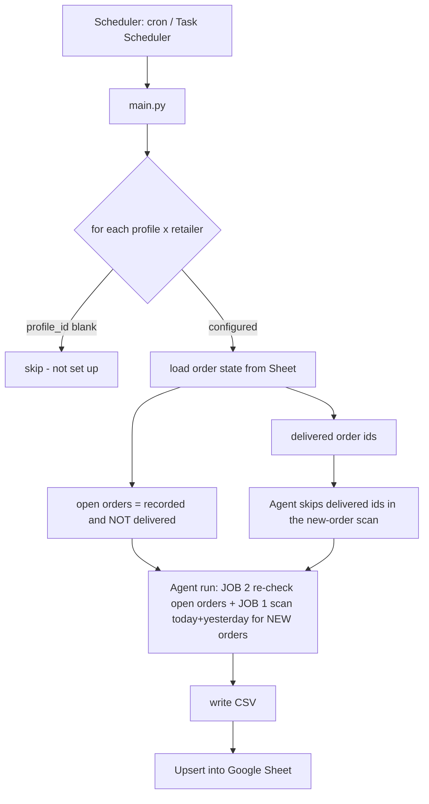
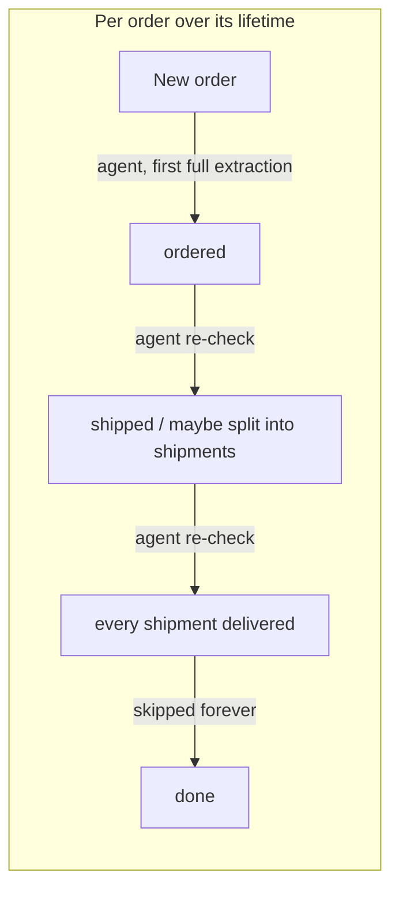

# Buying Group Ledger

Automated order tracking for buying-group reselling. It logs into retailer accounts (Amazon and
Best Buy today; Amazon Business / Walmart / Costco planned), captures new orders and their shipment status,
and keeps a Google Sheet ledger up to date — cheaply and hands-off.

It runs on **Browser-Use Cloud** (the browser runs in their cloud, not on your machine) and uses a
layered design so the expensive AI agent is only used where it's actually needed.

---

## How it works

Each run makes **one agent call per profile** that does two jobs: scan for **new** orders (JOB 1) and
re-check **already-recorded, not-yet-delivered** orders (JOB 2). Results are upserted into the Sheet.



### Cost model

Browser-Use bills mostly by **input tokens** — every agent step ships the whole page to the model.
Because both jobs share one agent call per profile, more open orders add *steps*, not extra runs.



- **New-order discovery + first extraction** → agent. A silently-broken selector here would mean a
  *permanently missed order* (missed reimbursement), so adaptability wins.
- **Re-checking open orders** → also the agent, for **both** retailers. It re-reads each order's
  details page and reports every shipment's current status / tracking / delivery date. This is
  required because an order can **split into multiple shipments at ship time** (each with its own
  delivery date), sometimes revealing a shipment late — a single cached tracking page can't see that.
- **Delivered orders** → skipped entirely; an order counts as delivered only once **every** shipment
  row is delivered.

> A cheap **CDP + CSS-selector** fast-path exists in the code (`scrapers/cdp.py`, `read_tracking_page`)
> for narrow, stable delivery-watches, but it's **currently unused**: Amazon disables it
> (`cdp_recheck_enabled = False`) because its orders can gain shipments after they look shipped, and
> Best Buy hands off to carrier sites. It's retained for future retailers (e.g. Amazon Business, which
> shares Amazon's tracking page).

### Data model / Sheet columns

One row per line item (its real quantity preserved — a qty-3 line is one row, not three), keyed on
**Order ID + Order Date + Item Name + Shipment** (safe upsert — re-checks update
status/tracking/date/last-scraped **without clobbering** the item name, cost, address, etc.):

`Retailer · Profile · Order ID · Order Date · Status · Order Link · Tracking Number · Tracking Link ·
Delivery Date · Delivery Address · Item Name · Quantity · Cost Per Item · Shipping · Total Cost ·
Card Last 4 · Last Scraped At · Shipment`

**Multiple shipments per order:** when an order splits across shipments, each shipment gets its own
row(s) with that shipment's own status, tracking number and delivery date. The **Shipment** column is
part of the key so the *same* product in two different shipments stays on two distinct rows instead of
colliding. It's the last column so adding it doesn't disturb existing rows; older sheets are migrated
automatically on the next sync.

- **Best Buy** uses the page's own labels (`Shipment One`, `Shipment Two`, …), single shipment included.
- **Amazon** numbers every shipment `Shipment 1`, `Shipment 2`, … (a single shipment is `Shipment 1`).
  Amazon starts an order as one shipment and often **splits it into several when it ships**, so numbering
  from the start means the original row updates in place (`Shipment 1`) and the newly-split shipments are
  added as new rows.

**Re-check routing.** Both retailers re-check open orders through the **agent**, which re-reads the whole
order-details page and reports every shipment. Amazon can add a shipment (with its own later delivery
date) after an order already looks shipped, so a cached single-page poll would silently miss it.

**Digital items are skipped** on every retailer (gift cards, eBooks, memberships, redemption codes,
etc.) — they're never resold, so they never hit the ledger.

---

## Concepts

- **Profile** = a Browser-Use cloud browser identity (`profiles.json`) with its own **static ISP
  proxy** and the set of **retailers** it's logged into. One profile can cover several retailers.
- **Sheet** = the source of truth. Each run reads it to decide what's new vs. what needs a re-check,
  and writes results back.
- **Alerts** = email (Gmail SMTP) + Discord webhook, fired on logged-out sessions and run failures.

---

## Install

Requires Python 3.11+ and a Browser-Use Cloud account with the **Dev tier** (custom proxies need a
paid plan).

```bash
# 1. dependencies
python -m venv .venv
# Windows:  .venv\Scripts\pip install -r requirements.txt
# Linux:    .venv/bin/pip install -r requirements.txt

# 2. config
cp .env.example .env          # then fill it in (see below)
cp profiles.example.json profiles.json
```

**`.env`** — fill in:
- `BROWSER_USE_API_KEY` (cloud.browser-use.com), `BROWSER_USE_LLM` (default `gpt-5.6-luna`)
- `GOOGLE_SERVICE_ACCOUNT_FILE` (path to the JSON key), `GOOGLE_SHEET_ID`, `GOOGLE_SHEET_WORKSHEET_NAME`
- `GMAIL_ADDRESS` + `GMAIL_APP_PASSWORD`, `ALERT_EMAIL_TO`, `DISCORD_WEBHOOK_URL`
- `LOOKBACK_DAYS` (default 1 = today + yesterday), `BROWSER_USE_MAX_COST_USD` (per-run cost cap)

**Google Sheet** — create a Google Cloud service account, download its JSON key to
`service_account.json`, and **share the sheet** with the service account's `…@…iam.gserviceaccount.com`
email as Editor. Put the sheet ID (from its URL) in `GOOGLE_SHEET_ID`.

**Test alerts** before relying on them:
```bash
.venv/bin/python -m alerts.notifier      # Windows: .venv\Scripts\python -m alerts.notifier
```

### Set up a profile (log in through its proxy)

Fill a profile's `proxy` in `profiles.json` (leave `profile_id` blank), then:

```bash
.venv/bin/python -m scripts.create_profile --label profile-1
# add a retailer to an existing profile later:
.venv/bin/python -m scripts.create_profile --label profile-1 --add-retailer walmart
```

It opens a live browser URL — log into the retailer(s) there, press Enter, and it saves the
`profile_id` back into `profiles.json`. Re-run it any time to log back in if a session expires.

---

## Running

```bash
# all retailers x all configured profiles:
.venv/bin/python main.py            # Windows: .venv\Scripts\python main.py

# a specific retailer:
.venv/bin/python main.py amazon
.venv/bin/python main.py bestbuy
```

> Best Buy discovers orders from the purchase-history page
> (`bestbuy.com/purchasehistory/purchases`), then opens each order's details page
> (`.../profile/ss/orders/order-details/<order-id>/view`) to read per-shipment tracking. Both
> retailers re-check open orders through the agent (see the cost model above).

Profiles with a blank `profile_id` are skipped. Output goes to `data/orders_*.csv` and the Sheet;
logs to `logs/run.log`. A lock (`logs/.run.lock`, auto-expires after 3h) prevents overlapping runs.

### Automatic running (~4×/day, 6h apart — adjustable)

**Linux (cron):**
```bash
./scripts/install_cron.sh          # every 6h -> 00:00 / 06:00 / 12:00 / 18:00
./scripts/install_cron.sh 4        # every 4h (re-run with any interval to change it)
```

**Windows (Task Scheduler)** — elevated PowerShell:
```powershell
powershell -NoProfile -ExecutionPolicy Bypass -File scripts\install_task_windows.ps1 -Hours 6
```

Both call the platform runner (`run.sh` / `run.ps1`), which `cd`s to the project root and appends to
`logs/cron.log`. To watch a run live on Linux: `tail -f logs/cron.log` (or `screen -S ledger ./run.sh`).

---

## Docker (portable / multi-instance)

Because the browser runs in Browser-Use Cloud, the image is lightweight (no Chromium — the bundled
Playwright is only a CDP *client*). The container **self-schedules** via supercronic, so no host cron
is needed. Best for Linux servers, cloud, or running several isolated instances; for a single desktop
the venv + Task Scheduler path is simpler.

Prereqs on the host: `.env`, `service_account.json`, and `profiles.json` present in the project dir
(they're mounted/injected at runtime and are excluded from the image via `.dockerignore` — secrets are
never baked in).

```bash
docker compose up -d --build      # build + start; runs every RUN_INTERVAL_HOURS
docker compose logs -f            # watch runs
docker compose down               # stop
```

Adjust the schedule in `docker-compose.yml` (`RUN_INTERVAL_HOURS`, default 6 = 4x/day). Set
`RUN_ON_START: "true"` to also run once at container start, and `TZ` to align the schedule to local
time. To run **multiple instances**, copy the compose service with a different `profiles.json`/`.env`
mounted per instance (e.g. one per proxy pool).

---

## Moving to another machine

Everything except the local environment is cloud-side (profiles, sheet, proxies), so migration is just:
copy the project **except** `.venv/`, `__pycache__/`, `data/`, `logs/`; be sure to bring the gitignored
`.env`, `service_account.json`, and `profiles.json` (they hold live credentials — move them securely);
then recreate the venv (`python -m venv .venv && …/pip install -r requirements.txt`) and re-install the
scheduler on the new host. No re-login or re-sharing needed.

---

## Project layout

```
main.py                 orchestration + run lock
config/settings.py      .env-backed settings
config/profiles.py      profiles.json loader + Sheet order-state reader
models/                 OrderItem + ProfileConfig schemas
scrapers/base.py        scrape(): CDP re-check + agent scan + merge/cleanup
scrapers/amazon.py      Amazon prompt + tracking-page selectors/reader
scrapers/bestbuy.py     Best Buy prompt (agent-only re-checks; no CDP selectors yet)
scrapers/cdp.py         Playwright-over-CDP browser helper (deterministic reads)
sheets/ledger_sync.py   Google Sheet upsert (safe partial refresh) + order-state loader
output/csv_writer.py    per-run CSV
alerts/notifier.py      email + Discord alerts
buying_groups/          BFMR / MaxOutDeals API clients (placeholders)
run.sh / run.ps1        scheduler entry points
scripts/                create_profile, install_cron, install_task_windows
Dockerfile / docker-compose.yml / docker/entrypoint.sh   containerized, self-scheduling
```
