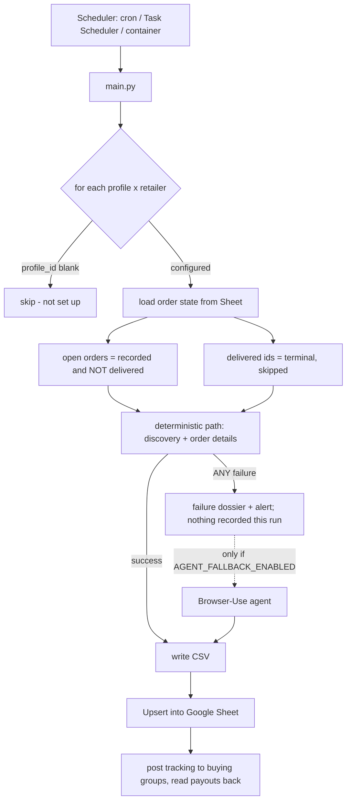
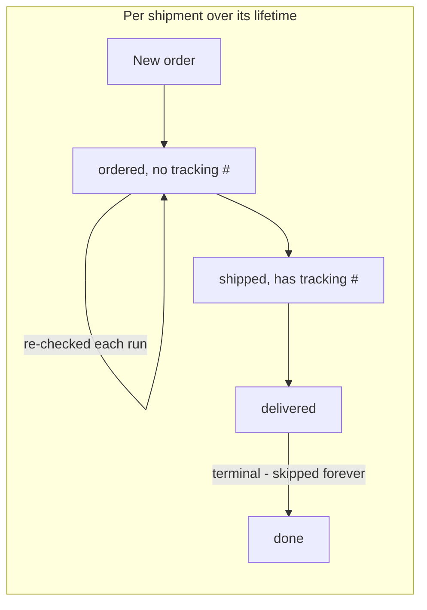

# Buying Group Ledger

Automated order tracking, reconciliation and payout settlement for buying-group reselling. It reads
order history from four retailer accounts (Amazon, Amazon Business, Best Buy, Costco), keeps a Google
Sheet ledger current as a live P&L, posts shipped tracking numbers to two buying-group APIs, files
shipment insurance, and reads payouts back — unattended, on a schedule.

**The design problem is cost against reliability.** A browser-driving LLM agent can read any retailer's
order page, but it bills real money on every run. A hand-written scraper is free but breaks *silently*
when a page changes — and a silently missed order is missed reimbursement, which is a worse outcome
than an expensive one. So every retailer has a **deterministic, agent-free primary path**, and when
that path fails it **fails loudly with a failure dossier** — the traceback, the page HTML and a
screenshot at the moment of failure, and an audit of every selector the parser depends on, written
to `logs/failures/` and pointed at by the alert. Normal runs cost nothing; a site change costs one
missed run and a selector fix, made from the dossier rather than guessed. The LLM agent still exists
as an opt-in fallback (`AGENT_FALLBACK_ENABLED`), off by default.

The second theme is that **the failures worth engineering against here are silent**. Nothing throws
when a scraper reads page 1 of a paginated order history and misses the rest, or when a re-check
overwrites a good tracking number with a blank. Most of the work below is invariants, idempotency and
auditing aimed squarely at that class of bug — see **[Design notes](#design-notes)**.

> **Status:** running in production against real accounts. `pytest` runs 1412 offline tests that need
> no credentials and no network.

---

## Design notes

The parts worth reading if you're here to look at the engineering rather than to run it:

| Idea | Where | Why it exists |
|---|---|---|
| Deterministic primary, loud failure | `scrapers/<retailer>{,_api,_mapping}.py` | Cost is a per-run tax; silent data loss is unbounded. A normal run spends nothing, and a failure records nothing rather than something wrong — and says so. |
| The failure dossier replaces the agent | `diagnostics/dossier.py`, `CdpBrowser.__exit__` | A paid agent run hid *what* broke. The dossier captures the page at the failure and audits every declared selector against it, so the fix is a code change made from evidence, not a retry that costs money. The agent is opt-in (`AGENT_FALLBACK_ENABLED`), off by default. |
| The schema is a wire format | `models/order.py` `FIELDNAMES`, `sheets/ledger_sync.py` `HEADER` | Rows are written *positionally*. Reordering columns without migrating scrambles every historical row with no error, so a test pins the pairing and the sync refuses to write a mismatched header. |
| Idempotent upsert, blanks never overwrite | `ledger_sync.py` `_merge_row`, `_collapse_records` | Re-checks return partial data. A blank field must never erase a known-good value, and two paths reporting the same row in one sync must collapse rather than clobber. |
| Reconcile on tracking number first | `ledger_sync.py` `sync_csv_to_sheet` | The deterministic path and the agent legitimately disagree about shipment *numbering*. Tracking number is an identity both read identically, so it beats the synthetic key. |
| Undisclosed-split safety net | `ledger_sync.py` | A retailer API that exposes one tracking number per line and rotates it will silently lose a box. An update that changes a non-blank tracking number to a *different* one appends instead of overwriting, and alerts. |
| Audit the live data, not just the code | `scripts/audit_sheet.py` | Tests prove the code; they can't see the sheet. 31 invariant checks, authenticated **read-only** so it cannot write even by accident. |
| Ask storage before opening a browser | `receipts/capture.py` | Receipt capture runs every scrape, but the existence check comes first — so the common re-check run creates no cloud browser at all, and a browser is only ever paid for by a genuinely new order. |
| Refuse to store a sign-in page | `receipts/sources.py` `looks_logged_out` | A login wall renders and uploads perfectly. Storing one would mark the order as having a receipt *forever*, because the object exists and no later run retries. |
| Catch silent misconfiguration at boot | `scripts/preflight.py`, `docker/healthcheck.sh` | A missing dependency degrades three retailers to the paid agent without raising; a dead scheduler produces no signal at all. Both now announce themselves. |

> **A note on `the design notes §N` references.** Code and test comments cite section numbers in `the design notes`, an
> internal engineering journal that records why each of these decisions was made and what live run
> proved it. That file is not published — it contains real order and payout data. The reasoning it
> holds is summarized in this README; the citations are left in place because they're accurate in the
> private repository the code is developed in.

---

## How it works

Each run, for every configured profile × retailer: read the Sheet to decide what's new versus what
needs re-checking, fetch through that retailer's **deterministic path**, and upsert the results back.
The LLM agent enters only when the deterministic path raises.



### The four deterministic paths

**No browser runs locally on any of them** — Playwright is used only as a CDP *client* to a cloud
browser, which is why this runs happily on a Raspberry Pi.

| Retailer | Primary path | Why it's shaped that way |
|---|---|---|
| **Costco** | Private GraphQL API over `curl_cffi` with a stored refresh token | No browser at all. Needs TLS impersonation to pass Costco's fingerprint check. |
| **Best Buy** | Cloud CDP browser → in-page `fetch` of `/profile/ss/api/v1/orders/<id>` | The endpoint is Akamai-guarded, so the read rides the logged-in session cookie *from inside the page* rather than replaying it out-of-band. |
| **Amazon** | CDP browser parsing server-rendered order-details HTML, then a hop to the package-tracking page | A network capture proved there is no order JSON to read — every JSON response was telemetry or recommendation carousels. The tracking number lives only on a separate page. |
| **Amazon Business** | Same parser; its own discovery and click-through pagination | Order details are identical to consumer Amazon; only discovery and pagination diverge, so it's a separate scraper that can't regress the consumer one. |

### Cost model

Browser-Use bills mostly by **input tokens** — every agent step ships the whole page to the model, so
cost is step-count × per-step page context. That makes the agent the expensive component, and is the
reason the deterministic paths exist: a normal run now spends no tokens at all.

**The agent is off by default** (`AGENT_FALLBACK_ENABLED=false`, since 2026-08-29). Once every
retailer's deterministic path had been live-validated, the agent fallback had become a per-failure
tax that *hid what broke*: a layout change produced a paid run and a row, not a fix. Now a
deterministic-path failure produces a **failure dossier** instead:

```
logs/failures/<retailer>_<profile>_<timestamp>/
  report.md       exception + traceback, a timeline of what the path was doing, and a SELECTOR
                  AUDIT: every selector the parser depends on, how many matches it got on the
                  captured page, and a sample of the text — a 0 where there used to be a hit is
                  the fix
  page_N.html     the DOM at the moment of failure (secrets + common PII patterns redacted)
  page_N.png      what it looked like
  response_N.txt  the API request/response, for the no-browser paths (Costco GraphQL)
```

The alert names the dossier path. Hand the directory to a coding agent with the retailer's
`_mapping.py` / `_api.py`; the captured HTML becomes the test fixture that proves the fix offline.
Nothing is recorded for that retailer that run, and the next scheduled run retries. A scrape that
*succeeds* but could not read part of a page (a tracking page whose selectors stopped matching, an
order-details page that failed to load) also leaves a dossier and alerts, because those used to be
silent. Login failures never ran the agent and still don't; their alerts now point at a dossier too.

Set `AGENT_FALLBACK_ENABLED=true` (or a retailer's `*_FORCE_AGENT` hook, which is an explicit request
to spend) to restore the old behaviour: the dossier is still written, then the agent runs — one call
per profile covering both jobs, scan for new orders (JOB 1) and re-check open ones (JOB 2). Pinning
the exact click path through Best Buy's sign-in flow (instead of letting the agent screenshot its way
to the password field) took a representative run from 3.35M to 932K tokens and $0.128 to $0.053.

**A shipment's lifecycle:**



An order is terminal only once **every** one of its shipment rows is delivered, so a split order stays
open until the last box lands. Terminal orders drop out of later runs entirely — which is what stops a
growing ledger from making every run slower and more expensive.

A **REST tracking API** tier (17TRACK, EasyPost) was evaluated as a cheaper delivery-watch and
**rejected**. Now that every retailer has a deterministic path, `shipped → delivered` already comes
free in the read being done anyway, so a per-shipment fee would buy a signal that's already there —
and the coverage it's weakest at, Amazon Logistics `TBA…` numbers, is the one gap it would have had to
fill. Its only real edge, real-time webhooks, doesn't matter against a multi-hour poll.

### Data model / Sheet columns

One row per line item (its real quantity preserved — a qty-3 line is one row, not three), keyed on
**Order ID + Order Date + Item Name + Shipment** (safe upsert — re-checks update
status/tracking/date/last-scraped **without clobbering** the item name, cost, address, etc.):

Columns follow the order events happen to an order, so the sheet reads forward as a timeline —
what it is → what happened to it → what it cost → what came back → profit, with the
rarely-scanned reference/audit columns parked at the end:

`Order Date · Status · Retailer · Item Name · Shipment · Quantity ·
Order ID · Tracking Number · Tracking Submitted · Delivery Date · Buying Group ·
Cost Per Item · Total Cost · Shipping · Card · Cashback Rate · COGS ·
Insurance · Payout Amount · Payout Date · Total Profit ·
Profile · Order Link · Tracking Link · Receipt Link · Delivery Address · Card Last 4 · Last Scraped At`

> **Changing the column order is a MIGRATION, not an edit**, and it takes two steps.
> `python -m scripts.reorder_sheet --apply` moves the row *values*; `python -m
> scripts.apply_sheet_formats --apply` then puts the presentation back. Both are dry-run by default.
>
> The second step is not optional, and the reason is easy to miss: **this sheet is a Google Sheets
> Table, and a table column's TYPE overrides the cell number format.** Set a cell to PERCENT under a
> CURRENCY column and nothing happens — silently, with the API returning success. Types and formats
> are both bound to a column *position*, so a reorder strands every one of them on its old letter. A
> real instance: a $631 payout rendering as `63100%`, and the checkbox moving off Tracking Submitted
> onto Delivery Address. `apply_sheet_formats` fixes both, derived from `HEADER` by name so it stays
> correct after any future reorder.
>
> **Status is pinned at column B.** The sheet's status colour rules are `=$B2="delivered"` and
> friends, and `reorder_sheet` rewrites values *without moving columns* — so moving Status would
> leave all six rules colouring every row by whatever landed in B. Insert new columns after it.
>
> The date columns are deliberately left **untyped**: `Order Date` is in the upsert key and must stay
> plain ISO text, or Sheets stores a serial and the next re-check duplicates the row.

**Receipt Link** points at the order's captured receipt in object storage — see "Receipt capture"
below. It's per *order*, so every row of a multi-item order carries the same link.

> **Column order is part of the wire format.** Rows are written to the sheet *positionally* from column
> A, so `FIELDNAMES` (models/order.py) and `HEADER` (sheets/ledger_sync.py) define where every value
> lands. Reordering them without rewriting the rows already on the sheet would silently scramble every
> one of them, so `sync_csv_to_sheet` **refuses to write** to a sheet whose header order doesn't match,
> and `python -m scripts.reorder_sheet --apply` is what conforms an existing sheet to a new order.
> **Adding** a column is the cheap case: append it to both lists and existing rows just gain a trailing
> blank — no migration needed.

**Rows are kept newest-first** (Order Date descending, then Order ID, then Shipment ascending — so a
multi-shipment order's rows stay adjacent and in shipment order). New rows are still *written* at the
bottom and the sheet is re-sorted afterwards, which is deliberate: the sync caches each matched row's
number from its pre-sync snapshot and writes updates to that row, so moving rows mid-sync would put
every update on the wrong one. Sorting only runs when a sync actually **appended** — an update rewrites
a row where it already sits and can't change the order — so a routine re-check run skips it. Use
`python -m scripts.sort_ledger` (dry run, then `--apply`) to sort by hand if the order ever drifts.

**Adding a row by hand** works, with two rules. Give it a real **Order ID** — the sort covers the whole
block from row 2 to the last row that has one, and a row without one is invisible to the upsert forever
(every future re-check appends beside it rather than updating it). And enter **Order Date as text** —
typing `2026-08-12` makes Sheets store a real Date, which changes the upsert key and duplicates the row
on its next re-check; type `'2026-08-12`, or format the column as plain text first. Get both right and
the row is indistinguishable from a scraped one: it sorts into place and gets its Total Profit formula
on the next append-triggered sort (`scripts/sort_ledger.py --apply` if you don't want to wait). Don't
hand-write **Total Profit** — it's position-bound and re-stamped on every sort. **Insurance** is yours
to fill in and is never overwritten by anything. **Payout Amount** and **Payout Date** are hand-entered
too, but the buying-group sync fills them in once the group pays (it never blanks a cell it has no
figure for, so a value you typed only changes if the group reports a different one). A note or spacer row belongs *below* the last order, where the sort leaves it alone; put one
inside the block and it gets shuffled in among the orders. `scripts/audit_sheet.py` flags all of this.

**Status** is one of `ordered`, `shipped`, `delivered`, `cancelled`, `paid`, `return`. The first two are
the live lifecycle the scrapers maintain; the other four are **terminal** — the order drops out of
future runs. `paid` and `return` come from the **buying group**, not the retailer (see "Buying
groups" below): BFMR reports both, MOD confirms `paid` by listing a package as received but has no
return signal, so a MOD return is typed in by hand. A status only ever moves forward, so that
hand-typed `return` survives every later run. Anything outside this vocabulary keeps the order **open forever**, so it
gets re-read on every run indefinitely — which on an agent retailer is a recurring cost on an order
that is already finished. `audit_sheet`'s `column_shape` fails an unknown status for exactly that
reason.

> **Only ever hand-import FINISHED orders** — `delivered`, `paid`, `return`, `cancelled`. Never import
> `ordered` or `shipped` rows. A single run already keeps those current: the scrapers discover open
> orders and re-check them to delivery on their own, so importing them by hand duplicates work the
> ledger does for free, and any detail you get slightly wrong (a re-worded item name, a different
> shipment number) becomes a duplicate row the next run appends beside yours. Terminal rows are the
> safe class precisely because nothing will ever re-read them — they're history, and no scraper will
> fight you over them.

### Bulk-importing history by hand

Pasting a batch of finished orders straight into the sheet is fine, and in one way safer than routing
them through `sync_csv_to_sheet`: a paste doesn't go through the upsert, so a mistake can't silently
overwrite an existing row. Errors just sit there as rows, and the audit names them.

**Before you paste — format `Order Date`, `Delivery Date` and `Payout Date` as Plain text.** This is the
one hard-to-undo step, because a Date-typed `Order Date` changes the row's upsert key. Convert to
`YYYY-MM-DD` while you're there.

Then, per row:

| Column | What to put in it |
|---|---|
| `Cost Per Item` | `Total Cost ÷ Quantity` — `total_cost_matches_quantity` fails if it doesn't reconcile |
| `Cashback Rate` | the **total** rate earned, as one number. If your source tracks base and bonus rates in separate columns, add them together |
| `Insurance` | a **positive** cost. The profit formula subtracts it |
| `Shipment` | `1`, unless one order has two rows with the **same item name** — then number them by tracking number, `1` and `2`, or they collide on one upsert key |
| `Shipping` | `0` if your costs are already all-in |
| `Total Profit` | nothing — it's a formula, re-stamped on every sort |

Leave `Profile`, `Order Link`, `Tracking Link`, `Delivery Address`, `Card Last 4` and `Last Scraped At`
blank if you don't have them; none of it is read for a terminal row. Fill `Card` and `Cashback Rate`
directly, since `Card` is normally *derived* from `Card Last 4` and that only happens during a scrape.

Finish with `python -m scripts.sort_ledger --apply`, then `python -m scripts.audit_sheet`.

**What the audit will and won't catch.** It's a strong net for *mechanical* errors — Date-typed cells,
duplicate keys, `Cost Per Item` not reconciling, text in numeric columns, embedded newlines, blank
Order IDs, unknown statuses, non-integer Shipment. All FAIL-level, all named with a row number.

It is blind to *semantic* ones. `cashback_rate_sane` only checks that a rate is plausible, so **1%
where you meant 13.5% passes silently**, as does a negative Insurance. So verify those two by
arithmetic instead: after pasting, compare the sheet's computed `Total Profit` against the profit your
old records show, on two or three rows chosen to cover each rate structure you use. If those agree to
the cent, the rate and sign mapping is right everywhere. It takes two minutes and it's the only check
that proves the numbers rather than the shapes.

**Total Cost is per row** = `Quantity × Cost Per Item` for that shipment line (computed in code, not
trusted from the agent), so the column sums to the order total. A `cancelled` order is only ever
recorded via a re-check (an order first seen as `ordered` that the order page later shows cancelled);
brand-new already-cancelled orders are ignored at discovery.

**Multiple shipments per order:** when an order splits across shipments, each shipment gets its own
row(s) with that shipment's own status, tracking number and delivery date. The **Shipment** column is
part of the key so the *same* product in two different shipments stays on two distinct rows instead of
colliding. Its value is a bare number (`1`, `2`) — the column heading already says "Shipment".

**Every retailer numbers shipments** `1`, `2`, … top-to-bottom, a single shipment
included. Amazon starts an order as one shipment and often **splits it into several when it ships**, so
numbering from the start means the original row updates in place (`1`) and the newly-split
shipments are added as new rows. Best Buy uses the same scheme deliberately: the label is part of the
upsert key, so a label that varies between runs (the page's own wording isn't guaranteed to be stable,
or present) would append a duplicate row instead of updating the existing one.

**Re-check routing.** Both retailers re-check open orders through the **agent**, which re-reads the whole
order-details page and reports every shipment. Amazon can add a shipment (with its own later delivery
date) after an order already looks shipped, so a cached single-page poll would silently miss it.

**Digital items are skipped** on every retailer (gift cards, eBooks, memberships, redemption codes,
etc.) — they're never resold, so they never hit the ledger.

**Profit accounting** (Card through Total Profit) turns the ledger into a P&L rather than just a tracker:

- **Card** and **Cashback Rate** are derived automatically from `Card Last 4`, which the scrapers
  already capture, via the `cards` section of `config.json` (see "Card / cashback config" below). Each card has an
  overall rate plus optional **per-retailer overrides**, so a card earning 1.5% generally and 5% at
  Amazon reports the right rate on each row. A card that isn't configured keeps a blank name — so the
  gap stays visible — but still gets your `DEFAULT_CASHBACK_RATE` so profit stays computable. The rate
  is the only cashback column; the dollar amount isn't stored, it's folded into Total Profit.
  On **Amazon**, if the order page advertises a bonus under the payment method ("Earn 5% back … plus an
  extra 1% back"), that extra is **added** to the card's configured rate for that order, so the single
  Cashback Rate cell carries the true total (`AMAZON_PROMO_CASHBACK_ENABLED=false` turns it off).
- **Gift cards earn no cashback**, so when one pays part of an Amazon or Amazon Business order the
  recorded cost is scaled down to what the *card* actually paid — Total Cost, Shipping and the cashback
  they drive all reflect card spend only, which raises reported profit by the gift-card amount. The
  reduction is capped at the pre-tax basis (Amazon applies gift cards to tax too, which this ledger
  doesn't track). `AMAZON_GIFT_CARD_NETTING_ENABLED=false` records the full sticker cost instead.

  **The accounting rule this implies:** a cost is recorded ONCE, where the money actually left your
  pocket. So if you *bought* the gift card, add its purchase as its own row and the two reconcile —
  a $40 card bought at face value and spent on a $100 order totals the same profit as simply paying
  $100 on the card, and a card bought at a discount shows the spread as real profit. If the gift card
  was *given* to you, there is no purchase row and its value is pure profit, which is correct.
  On **Amazon**, that purchase row is now created FOR you when the gift card was bought on a card that
  carries an explicit Amazon rate in `config.json`'s `cards` section — such a card is a reselling card, so the gift card is
  funding inventory. It lands as a `delivered` row with cost and cashback and no tracking. A gift card
  bought on any other card is treated as personal and skipped, as are all other digital items; if you
  need one of those on the ledger, add it by hand.

  Such a row is tagged **`Gift Card`** in the Buying Group column, and that tag is *deliberate
  non-routing* — distinct from the two accidental kinds:

  | Tag | Meaning | Behaviour |
  |---|---|---|
  | `Unclassified` | a warehouse nobody configured | a gap to FIX — **alerts** if the row has tracking |
  | `Personal` | your own address | **dropped**, never reaches the ledger |
  | `Gift Card` | not a resale at all | **kept**, routed nowhere, and silent |

  The distinction earns its keep: a gift card ships with a tracking number like anything else, and
  without it every gift-card row would sit in `sync_tracking`'s unroutable list alerting on every run
  as though a reimbursement were about to be lost — training you to ignore the one alert that means
  exactly that. The tag also **wins over the delivery address**, so a card shipped to your own home
  isn't classified `Personal` and deleted. Hand-entered gift-card rows should carry the same tag.
- **Insurance**, **Payout Date** and **Payout Amount** are filled by the buying-group sync (see
  "Buying groups" below) — or by hand until you enable it. The scrapers always write them blank, and
  the upsert's blank-never-overwrites rule is what stops a re-scrape from wiping what you typed.
- **COGS** and **Total Profit** are **live Google Sheets formulas**, not scraped numbers:

  ```
  COGS         = (Total Cost + Shipping) × (1 − Cashback Rate)
  Total Profit = Payout Amount − COGS − Insurance
  ```

  **COGS exists for end-of-year tax**, and the split is where the tax form wants it. Cashback is
  netted into *cost* rather than counted as income, because a card reward earned on a purchase is a
  purchase-price adjustment, not receipts. **Insurance is deliberately not in COGS** — a buying-group
  premium is an ordinary business expense, a separate line on the form. Expand COGS and you get the
  old single-cell profit formula exactly; the two are the same number, split where it's useful.

  Unlike Total Profit, **COGS does not blank on an unpaid row**: the cost was incurred whether or not
  the group has paid yet, and the year-end cost side has to count it.

  It's a formula so it recalculates the instant you type an Insurance or Payout Amount — a value
  computed at scrape time would go stale immediately, and a `delivered` row is terminal and never
  re-scraped, so it would stay stale forever. The cell reads blank (not `0`) until Payout Amount is
  filled, so un-paid-out rows don't drag a column sum down with fake losses.

  **Shipping is allocated pro-rata across an order's rows** (`Shipping × this row's Total Cost ÷ the
  order's Total Cost`). Every retailer reports one *order-level* shipping total and repeats it on every
  row, so charging it per row would bill a 3-row order for shipping three times over and make the
  column's sum wrong. Pro-rata makes the column sum to exactly one shipping charge per order.

**A cancelled order carries no money.** Cost, Shipping, Insurance, Payout and both formula columns
are emptied on any row whose Status is `cancelled` — the order was refunded, so leaving the scraped
cost there makes it look like a real purchase to anything summing the column, and at year end that is
an overstated cost of goods. The row itself stays: what was ordered, from whom, and that it was
cancelled is worth keeping. This is applied on every write, so future cancellations clean themselves.

**Buying Group** classifies each row's `Delivery Address`: which buying group's warehouse the order
shipped to, or `Unclassified` when the address matches no configured warehouse. It's derived at run time
from the `warehouses` section of `config.json` (see "Warehouse / jig config" below), so it also sets up the later
buying-group tracking-post step. **Personal orders are dropped entirely** — an address matched to a group
named `Personal` (your own reship/consumer addresses) never reaches the sheet. `Unclassified` is
deliberately *not* treated as personal: a real warehouse you simply haven't configured yet is kept and
counted (in the run log) rather than silently disappearing. A blank address on a partial re-check leaves
the tag untouched.

---

## Concepts

- **Profile** = a Browser-Use cloud browser identity (a `config.json` `profiles` entry) with its own **static ISP
  proxy** and the set of **retailers** it's logged into. One profile can cover several retailers.
- **Sheet** = the source of truth. Each run reads it to decide what's new vs. what needs a re-check,
  and writes results back.
- **Alerts** = email (Gmail SMTP) + Discord webhook, fired on logged-out sessions and run failures.

---

## Install

Requires Python 3.11+ and a Browser-Use Cloud account with the **Dev tier** (custom proxies need a
paid plan).

```bash
# 1. dependencies
python -m venv .venv
# Windows:  .venv\Scripts\pip install -r requirements.txt
# Linux:    .venv/bin/pip install -r requirements.txt

# 2. config — ONE file
cp config.example.json config.json     # then fill it in (every key is commented in place)
```

**`config.json` is the whole setup**: credentials, profiles, warehouse jigs and card cashback rates,
plus the Google service-account key inlined. It is gitignored. The example file documents every key
next to it, so this is the only thing to read.

> **Environment variables override every value in it**, from `.env` or the shell — the name is in
> each key's `// note`. **Nothing is environment-only**, so `.env` is entirely optional; it exists
> purely as the override layer, which is where dev and host-specific values belong:
>
> ```bash
> COSTCO_FORCE_AGENT=true python main.py costco               # exercise the paid agent fallback, once
> BFMR_MIN_INSURANCE_VALUE=999 python -m sync_tracking     # just this run
> LOOKBACK_DAYS=14 python main.py amazon                   # re-scan a wider window
> ```
>
> Put something in the `.env` FILE when it should differ on *this machine* — a dev box pointed at a
> scratch `GOOGLE_SHEET_ID`, or a host that runs on its own `RUN_INTERVAL_HOURS`. A blank value
> (`FOO=`) does **not** override; it falls through to `config.json`, so commenting a line out works
> the way you would expect.
>
> Even the container's own knobs come from the config file. `docker-compose.yml` interpolates its
> variables before any Python runs, so `docker/entrypoint.sh` resolves `container.*`
> (`run_interval_hours`, `run_on_start`, `preflight_strict`, `timezone`) through
> `scripts/container_settings.py` on start — and still lets an exported variable win.

<details>
<summary><b>Every environment variable, and the <code>config.json</code> key it overrides</b> (38 of them)</summary>

The list is generated from `ENV_TO_CONFIG` in [config/settings.py](config/settings.py), which is the
single place a name is mapped, and `tests/test_config_loader.py` fails if this table drifts from it.
**Booleans (marked †) take `true` / `false`** — in the config file and the environment alike. `1`,
`yes` and `on` still parse, but anything unrecognised is **false**, so a switch that spends money
fails closed on a typo rather than turning itself on.

| Variable | `config.json` key |
|---|---|
| `BROWSER_USE_API_KEY` | `browser_use.api_key` |
| `BROWSER_USE_LLM` | `browser_use.llm` |
| `BROWSER_USE_MAX_COST_USD` | `browser_use.max_cost_usd` |
| `AGENT_FALLBACK_ENABLED` † | `browser_use.agent_fallback_enabled` |
| `GOOGLE_SERVICE_ACCOUNT_FILE` | `google.service_account_file` |
| `GOOGLE_SHEET_ID` | `google.sheet_id` |
| `GOOGLE_SHEET_WORKSHEET_NAME` | `google.worksheet_name` |
| `DISCORD_WEBHOOK_URL` | `alerts.discord_webhook_url` |
| `ALERT_EMAIL_TO` | `alerts.email_to` |
| `GMAIL_ADDRESS` | `alerts.gmail_address` |
| `GMAIL_APP_PASSWORD` | `alerts.gmail_app_password` |
| `AMAZON_GIFT_CARD_NETTING_ENABLED` † | `scraping.amazon_gift_card_netting_enabled` |
| `AMAZON_PROMO_CASHBACK_ENABLED` † | `scraping.amazon_promo_cashback_enabled` |
| `DEFAULT_CASHBACK_RATE` | `scraping.default_cashback_rate` |
| `LOOKBACK_DAYS` | `scraping.lookback_days` |
| `BFMR_API_BASE_URL` | `buying_groups.bfmr.api_base_url` |
| `BFMR_API_KEY` | `buying_groups.bfmr.api_key` |
| `BFMR_API_SECRET` | `buying_groups.bfmr.api_secret` |
| `BFMR_MIN_INSURANCE_VALUE` | `buying_groups.bfmr.min_insurance_value` |
| `MAXOUTDEALS_API_BASE_URL` | `buying_groups.mod.api_base_url` |
| `MAXOUTDEALS_API_KEY` | `buying_groups.mod.api_key` |
| `MAXOUTDEALS_EMAIL` | `buying_groups.mod.email` |
| `MAXOUTDEALS_USER_ID` | `buying_groups.mod.user_id` |
| `BUYING_GROUP_SYNC_ENABLED` † | `buying_groups.sync_enabled` |
| `RECEIPT_CAPTURE_ENABLED` † | `receipts.capture_enabled` |
| `OCI_BUCKET` | `receipts.oci.bucket` |
| `OCI_PAR_URL_PREFIX` | `receipts.oci.par_url_prefix` |
| `OCI_S3_ACCESS_KEY_ID` | `receipts.oci.s3_access_key_id` |
| `OCI_S3_ENDPOINT_URL` | `receipts.oci.s3_endpoint_url` |
| `OCI_S3_REGION` | `receipts.oci.s3_region` |
| `OCI_S3_SECRET_ACCESS_KEY` | `receipts.oci.s3_secret_access_key` |
| `PREFLIGHT_STRICT` † | `container.preflight_strict` |
| `RUN_INTERVAL_HOURS` | `container.run_interval_hours` |
| `RUN_ON_START` † | `container.run_on_start` |
| `TZ` | `container.timezone` |
| `AMAZON_FORCE_AGENT` † | `dev.force_agent.amazon` |
| `AMAZON_BUSINESS_FORCE_AGENT` † | `dev.force_agent.amazon_business` |
| `BESTBUY_FORCE_AGENT` † | `dev.force_agent.bestbuy` |
| `COSTCO_FORCE_AGENT` † | `dev.force_agent.costco` |

</details>

**Already have the old six files?** `python -m scripts.migrate_config` (dry run, secrets masked),
then `--apply`. It folds `.env`, `profiles.json`, `warehouses.json`, `cards.json`,
`service_account.json` and `.costco/*.json` into `config.json` + `.state.json`, and never deletes the
originals — so it is reversible by deleting `config.json`. Delete them yourself once a run has proven
the new file works; preflight warns while they linger, because nothing reads them any more.

**Google Sheet** — create a Google Cloud service account, paste its whole JSON key into
`google.service_account`, and **share the sheet** with that key's `…@…iam.gserviceaccount.com` email
as Editor. Put the sheet ID (from its URL) in `google.sheet_id`. (`GOOGLE_SERVICE_ACCOUNT_FILE` still
points at a standalone file instead, and wins when set.)

**`.state.json`** is the app's own file — currently just Costco's rotating refresh token. You never
edit it, and deleting it only costs a re-run of `scripts.costco_token`. It is separate from
`config.json` precisely so the config you author can stay read-only in Docker.

**Test alerts** before relying on them:
```bash
.venv/bin/python -m alerts.notifier      # Windows: .venv\Scripts\python -m alerts.notifier
```

### Set up a profile (log in through its proxy)

Fill a profile's `proxy` in `config.json`'s `profiles` list (leave `profile_id` blank), then:

```bash
.venv/bin/python -m scripts.create_profile --label profile-1
# add a retailer to an existing profile later:
.venv/bin/python -m scripts.create_profile --label profile-1 --add-retailer walmart
```

It opens a live browser URL — log into the retailer(s) there, press Enter, and it saves the
`profile_id` back into `config.json`. Re-run it any time to log back in if a session expires.

> ⚠️ **Close that browser window when you're done, and don't leave one open while runs are
> scheduled.** A profile's state is saved when a session *closes*, so the last session to close wins.
> A stale window lingering in the background will write its own (possibly logged-out) cookies over
> the profile, silently discarding a sign-in a scheduled run had just completed. The symptom is
> "it logs in every run and never stays logged in", which looks exactly like a broken login — so
> rule this out first.

**Auto-auth (username + password + an authenticator code).** A dead session is a run that records
nothing, and the two retailers that log out do it for different reasons: **Best Buy**'s web sessions
die in ~20–25 min, and **Amazon Business** lapses occasionally but was, until 2026-08-25, the one
retailer that could never heal itself. Give the profile an `auth` block, keyed by retailer, and both
sign themselves back in:

```json
"auth": {
  "bestbuy":         { "method": "password", "username": "you@example.com", "password": "…", "totp_secret": "…" },
  "amazon-business": { "method": "password", "username": "you@example.com", "password": "…", "totp_secret": "…" }
}
```

> ⚠️ **Turn 2-step verification ON, with an AUTHENTICATOR APP**, and paste that enrolment's base32
> key (the "can't scan the barcode?" key) into `totp_secret`. This reverses the older "turn 2FA off"
> advice, and the reason is worth keeping: leaving it off did **not** make sign-in reliable — Best
> Buy kept escalating untrusted sessions to a challenge offering only *"text me a code"*, which
> nothing here can receive, so a run died as a mystery logout. An authenticator code is the one
> challenge a script can answer unattended. It generates the 6-digit code itself and ticks the
> *"don't ask on this device"* box, so a trusted device makes the next lapse need no code at all.
>
> **Enrol the app, not SMS or email.** Which challenge the site serves follows what the account has
> enrolled, so an SMS-only account still stops the run cold.

`password` is the only supported method. Google SSO and Apple were removed in 2026-08-13: each was a
second login path that had to keep working, exercised only when a session happened to die, so a break
in one surfaced days later as a mystery logout. Passkeys were never usable — Browser-Use's cloud
browser has no WebAuthn support. (Amazon's sign-in page shows a permanent passkey error banner for
exactly that reason; it's noise, and the sign-in code ignores it.)

Where the secrets go depends on which path runs:

- the **deterministic path** (normal case) types them into a CDP browser on your machine and computes
  the code locally — it builds no prompt, so nothing leaves the host;
- the **agent fallback** puts the password in the task prompt, because Browser-Use v4 has no
  secret-injection channel — so it's visible to the LLM and kept in the cloud run history.

**The TOTP seed is never given to the agent**, on either retailer. A one-time code is derivable only
from the seed, so handing the seed to an LLM would trade a 30-second secret for a permanent one. The
agent therefore can't pass 2FA — it alerts and skips, which is the right outcome for an auth failure
anyway, since the agent cannot fix one. (Amazon Business's agent is told not to attempt a sign-in at
all.)

Without an `auth` block a profile just reports logged-out and alerts, without trying to log in.

> **A failed sign-in never falls through to the paid agent.** It alerts with a *classified* reason —
> a stale password, a locked account, a CAPTCHA, an SMS-only challenge, or auth requests dying at the
> network layer — because those need four different responses and are indistinguishable otherwise.
> Sign-in is also attempted **once per run, never retried**: repeated automated attempts are what
> escalate an account to a forced reset or a lock, and a skipped run is far cheaper than that.

### Tests

```bash
.venv/bin/pip install -r requirements-dev.txt
.venv/bin/python -m pytest            # Windows: .venv\Scripts\python -m pytest
```

Fully offline and free — no credentials, no network, no Browser-Use run. They cover the parts that
fail *silently* rather than loudly: column drift between `FIELDNAMES`/`HEADER` (rows are written
positionally, so drift misaligns every row), the blank-preserving upsert, the delivered rollup, agent
JSON parsing, status normalization, and prompt instructions that data integrity depends on. Behavior
that only a real page can prove — selector accuracy, whether an order actually splits — still needs a
live run.

### Auditing the sheet

`pytest` proves the *code* is right; it can't see the live sheet. `scripts/audit_sheet.py` checks the
sheet itself against every invariant the ledger depends on, and **writes nothing, ever** (it
authenticates with a read-only scope, so it isn't merely well-behaved — it isn't permitted to write):

```bash
.venv/bin/python -m scripts.audit_sheet                  # Windows: .venv\Scripts\python -m ...
.venv/bin/python -m scripts.audit_sheet --expect-rows 23 # also assert the row count
```

It's worth running **before and after** a live run — the diff is what proves a run updated rows
instead of duplicating them, and `--compare` does that for you:

```bash
.venv/bin/python -m scripts.audit_sheet --save-snapshot before.json
.venv/bin/python main.py
.venv/bin/python -m scripts.audit_sheet --compare before.json
```

That reports added / removed / changed rows keyed on the upsert key, so a run that appended a
genuinely new order is immediately distinguishable from one that duplicated an existing row.
(`Last Scraped At` is ignored — it changes on every touch and would otherwise mark every row as
changed.) Exit code is `0` when nothing failed, `1` on a failure (or on a warning under `--strict`),
so it can gate a scheduled run.

What it checks, and why each one matters: the header matches `HEADER` **exactly** (right names in the
wrong order is the one failure that scrambles every row with no error — see the column-order warning
above); no duplicate upsert keys, on all three of the keys `sync_csv_to_sheet` uses; every row's
`Total Profit` still holds the *live formula* rather than a number frozen from a past read, and that
formula still points at the current columns; and that the cell **types** are intact — `Shipment` an
int, `Card Last 4` text with its leading zeros, the money columns numeric rather than `"$1,299.00"`
text, and the date columns plain ISO text.

That last one is the one to care about. **`Order Date` is part of the upsert key**, so if the date
columns are ever re-formatted as real Dates, a row without a tracking number will append a duplicate
on its next re-check. A more general check catches the same class of bug for any key column: it
builds each row's key twice — once from the displayed text and once from the stored value — and
fails if they differ, i.e. if a row's identity depends on how you happen to have formatted it.

It also checks the things that go wrong *around* the data rather than in it: content outside the
25-column block (a stray note below the data misplaces the next appended row), `#REF!` errors left by
a deleted column, a cashback rate outside 0–1, merged cells (they blank their neighbours on read), and
**open orders that stopped being re-scraped** — the failure nobody notices, whether that's an order
stuck open forever or the scheduler silently not running. Tune that last one with `--stale-days`.

Two flags make it free to iterate on: `--save-snapshot FILE` dumps the raw sheet, and
`--from-snapshot FILE` re-audits that dump offline with no credentials and no API calls. `--json`
emits the same results machine-readably, `--compare` included.

---

## Running

```bash
# all retailers x all configured profiles:
.venv/bin/python main.py            # Windows: .venv\Scripts\python main.py

# a specific retailer:
.venv/bin/python main.py amazon
.venv/bin/python main.py amazon-business
.venv/bin/python main.py bestbuy
.venv/bin/python main.py costco
```

> Best Buy uses a deterministic primary path like Costco (no agent): a CDP browser holds the profile's
> logged-in cookie, discovers order ids from the purchase-history page's embedded data, and reads each
> order's detail from Best Buy's own `/profile/ss/api/v1/orders/<id>` endpoint via an in-page fetch —
> tracking numbers, per-item cost, card, and native shipment grouping all come structured. If that path
> fails (login, page shape, network) it writes a failure dossier and alerts (see "Cost model").
> **Costco is similar**: it reads orders from Costco's
> private GraphQL API using a stored refresh token — no browser and no agent — and tracks **online
> shipped orders only** (in-warehouse pickups and Same-Day/Instacart grocery are skipped). If that API
> ever fails, the dossier holds the failing request/response. See "Costco API setup" below.
> **Amazon and Amazon Business** also have a deterministic primary path (no order JSON exists, so a CDP
> browser parses the order-details HTML and reads each shipment's tracking number off Amazon's own
> package-tracking page), with the same dossier-on-failure behaviour. Amazon Business is a
> separate scraper (`retailer_key` `amazon-business`) that shares Amazon's tracking page but has its own
> order-history discovery + pagination; keep the two Amazon accounts on separate profiles.

### Costco API setup (one-time)

Costco's primary path uses its private GraphQL API instead of a browser, so it needs a **refresh
token** grabbed once from a logged-in browser session (it's long-lived; redo only if revoked):

1. Log into `costco.com`, open DevTools → Application → Local Storage → `https://signin.costco.com`,
   and copy the `secret` of the key whose name contains `refreshtoken`.
2. Save it against the profile that owns this membership (847 covers all US warehouses):
   ```bash
   python -m scripts.costco_token --label profile-2 --token "<REFRESH_TOKEN>" --warehouses 847
   ```
   (There's also a best-effort `--grab` that reads the token from a logged-in profile over CDP, but
   Costco encrypts its stored token, so the manual `--token` copy above is the reliable path.)

The token is written to `.state.json` (gitignored — treat it like a password). This path
also needs the extra deps in `requirements.txt` (`curl_cffi`, `PyJWT`); re-run the pip install if you
set the project up before Costco was added. If the token is missing/expired or the API changes shape,
Costco alerts and falls back to the Browser-Use agent for that run.

Profiles with a blank `profile_id` are skipped. Output goes to `data/orders_*.csv` and the Sheet;
logs to `logs/run.log`. A lock (`logs/.run.lock`, auto-expires after 3h) prevents overlapping runs.

### Warehouse / jig config (the "Buying Group" column)

To classify each order by which buying group's warehouse it shipped to, fill the **`warehouses`**
section of `config.json` — `config.example.json` has a commented starting point:

```json
"warehouses": [
  { "buying_group": "BFMR",
    "jigs": [
      { "label": "BFMR-A", "street": "123 Main St", "zip": "10001", "name_contains": "c/o BFMR" },
      { "label": "BFMR-B", "street": "500 Warehouse Blvd", "zip": "07004" }
    ] },
  { "buying_group": "Personal",
    "jigs": [ { "label": "home", "zip": "94103", "name_contains": "Your Name" } ] }
]
```

Each buying group lists one or more **jigs** — the address variants it routes packages through. A jig
matches an order when **every** substring field it sets (`street` / `zip` / `name_contains`, or a generic
`contains: [...]` list) appears in the delivery address after normalization (lowercased, punctuation and
extra spaces removed — so "c/o" vs "c o" and "Ste." vs "Ste" don't matter). The first matching jig (in
file order) wins and its `buying_group` is written to the row.

- List your own reship address under a group literally named **`Personal`** — those orders are **dropped
  from the sheet entirely** (never recorded). List every personal address you use, or the order will fall
  through to `Unclassified` and still show.
- An address matching **no** jig is tagged **`Unclassified`** (kept, not dropped), and the run logs how
  many — a real warehouse you forgot to add stands out instead of silently vanishing. A jig with no match
  fields is rejected (it would match everything).
- No `warehouses` section at all = every non-blank address is `Unclassified` (nothing is guessed).
- Editing the file re-tags **open** orders on the next run (they get re-read); already-delivered rows
  keep their tag. Classification is offline and free — no live run is needed to change it.

### Card / cashback config (the "Card" and "Cashback Rate" columns)

Every scraper already captures the last 4 digits of the card an order was charged to. The **`cards`**
section of `config.json` turns those digits into a card name and a cashback rate:

```json
"cards": [
  { "last4": "4321", "name": "Chase Freedom Unlimited", "cashback_rate": 0.015,
    "retailer_rates": { "Amazon": "5%", "Best Buy": "3%" } },
  { "last4": "8765", "name": "Citi Double Cash", "cashback_rate": "2%" },
  { "last4": "1111", "name": "Amex Business Platinum",
    "retailer_rates": { "Amazon Business": "5%" } },
  { "last4": "1111", "name": "Personal Amex Gold", "cashback_rate": "4%", "profile": "profile-1" }
]
```

**Each card gets an overall rate plus optional per-retailer overrides**, because a card's earn rate is
category-dependent in practice. The rate for a row resolves in three tiers, most specific first:

1. the card's **`retailer_rates`** entry for that row's retailer — this card, at this store
2. the card's **`cashback_rate`** — its overall rate everywhere else
3. **`DEFAULT_CASHBACK_RATE`** (`scraping.default_cashback_rate`) — for cards you haven't
   configured at all

Details:

- Rates are **decimal fractions** (`0.015` = 1.5%); `"1.5%"` is accepted and converted, in both
  `cashback_rate` and `retailer_rates`. A bare `2` is **rejected** rather than guessed at — it reads
  equally as 2% or 200%, and picking wrong would misstate every profit number by 100×.
- `retailer_rates` keys are matched loosely: `"Best Buy"`, `"bestbuy"` and `"best-buy"` are the same
  key. A key that names **no** retailer this ledger scrapes logs a warning at load — a typo'd override
  would otherwise never apply and nothing would say so.
- `last4` is matched **normalized**, so it doesn't matter that Amazon says "ending in 4321", Best Buy
  sends `************4321`, and Costco sends `xxxx4321`.
- Two *different* cards can genuinely share a last 4 across accounts. Add an optional **`profile`** (a
  a `profiles` label) to scope an entry; the scoped entry wins over the catch-all, and genuinely
  ambiguous duplicates log a warning rather than one being silently picked. (There's no `retailer`
  scope — one physical card is used at many retailers, and what varies per retailer is the *rate*.)
- A card that's charged but **not configured** gets a blank Card name (so the gap is visible, and a
  name you type by hand survives) and the default rate. No `cards` section at all = every row gets the
  default rate and no name.
- Like the warehouse config, this is offline and free — editing it re-derives the columns for **open**
  orders on the next run. Delivered rows are terminal and keep what they were tagged with.

### Buying groups (posting tracking numbers, and reading payouts back)

Scraping tells you what you bought. The buying group is who pays you for it — so `sync_tracking.py`
posts each shipped package's tracking number to the right group, and reads their payout back into the
**Insurance**, **Payout Amount** and **Payout Date** columns, which is what makes **Total Profit**
light up (the formula stays blank until Payout Amount is filled).

> ### ⚠️ You still submit BFMR order numbers by hand
>
> **After placing an order against a BFMR reservation, enter its order number in BFMR yourself, right
> away.** This tool does not do it, and is not going to.
>
> That is not an oversight — it is what makes everything below work. BFMR keys on its own
> `reservation → purchase → shipment` chain, and your order number is what turns a *reservation* into
> a *purchase*. Until that happens there is nothing for a tracking number to attach to, so
> `sync_tracking` reports the package as having no purchase rather than guessing which deal you meant.
> A reservation also expires if its order number arrives late, and BFMR cancels a purchase whose
> tracking misses the deadline.
>
> Choosing the reservation automatically would mean matching a deal against a ledger row, and getting
> it wrong books the **wrong deal** — which cannot be undone here, because this tool never cancels
> anything at a buying group. You already know which deal you bought at the moment you buy it; typing
> the number then costs seconds and cannot go wrong.
>
> MaxOutDeals needs none of this — it keys on the tracking number alone, so posting is fully automatic.

**A filing carries the tracking number and nothing else.** BFMR's `insurance/file` also accepts
`address[...]` fields, but those are the **payee** address — where a claim pays out — not the
shipment's destination, so omitting them lets BFMR use the address on your account, which is already
the right answer. `name` and `package_value` are omitted for their own reasons: your account supplies
the name, and BFMR derives the value from the shipment's items, where declaring our own would risk
over-declaring and paying a bigger premium than the box warrants.

Nothing ever files a **jig** as a postal address, either. A jig is a deliberately misspelled variant
(`THIRTEEN SAMMPLE DR1VE`) that a group hands out so each order routes distinctly; it is a routing
token, and the only thing it is matched against is the `warehouses` config that sets the Buying Group
column.

Two groups are supported today, and they work nothing alike:

| | **BFMR** | **MaxOutDeals** |
|---|---|---|
| auth | `API-KEY` + `API-SECRET` headers | bearer token **+ an IP allowlist** |
| keyed on | its own reservation → purchase → shipment ids | the tracking number |
| order number | **you enter it, by hand, at order time** | not used |
| batching | one object per ledger row | one object per package (rows summed) |
| limits | undocumented | **10/day** payouts, **30/day** tracking |

```json
"buying_groups": {
  "bfmr": {
    "// ": "both from Developer Tools in your BFMR account settings",
    "api_key": "...",
    "api_secret": "...",
    "// min_insurance_value": "0 = insure every shipment",
    "min_insurance_value": 0
  },
  "mod": {
    "// ": "MOD also needs the account id + email it wants in the body of every request",
    "api_key": "...",
    "user_id": "...",
    "email": "..."
  }
}
```

(A key whose name starts with `//` is a comment — the loader strips them, so you can annotate your
own `config.json` the way `config.example.json` does.)

⚠️ **MaxOutDeals rejects any call from an unregistered IP**, however valid your token. Add the machine
that runs this under the **firewall tab** in your MOD profile — and again if you move hosts, change
ISP, or containerize it.

```bash
python -m scripts.bg_probe          # read-only recon; answers the open API questions
python -m sync_tracking             # DRY RUN — shows exactly what it would send. Sends nothing.
python -m sync_tracking --apply --limit 1     # one package per group, for the first live test
python -m sync_tracking --void 1Z999...       # undo a BFMR insurance filing
```

**Routing is the Buying Group column**, which is already derived from the delivery address (see
"Warehouse / jig config"). A row goes to exactly one group. `Personal` orders never reach the sheet,
and `Unclassified` rows are **skipped and counted** rather than posted to a guess — an unconfigured
warehouse is a real warehouse, and sending someone else's package to the wrong group is worse than
leaving it visible.

**There's no "posted at" column, deliberately.** Whether a number has been submitted is something the
group knows and the sheet doesn't: MOD ignores duplicates by contract, and BFMR has a status
endpoint, so each run asks rather than keeping a local copy that drifts the moment a write fails or
you paste something into their dashboard by hand.

**A payout is split pro-rata** across the rows sharing a tracking number, for the same reason
order-level shipping is — a box holding two items is two rows, and writing the whole payout to each
would book it twice.

**Status advances to `paid` or `return`.** Those are the two outcomes a retailer can never tell you
about, so the buying group is the authority on them:

- **BFMR reports both directly** — its tracker carries `paid` and `returned` per package.
- **MaxOutDeals confirms payment by listing a package in its received-items report**; there is no
  finer signal. ⚠️ **MOD gives no return signal at all**, so a returned MOD package will keep reading
  `paid` until you set its Status to `return` on the sheet **by hand**. That correction is safe: a
  status only ever moves forward, so later runs won't undo it.
- Everything earlier in the journey (`shipped`, `delivered`) stays the retailer's to report — if both
  sources wrote it, they'd overwrite each other every run.

**A payout is only written once the group has actually paid.** An unpaid package leaves the cell
blank rather than writing `0` — Total Profit reads a blank as "not paid out yet", but a literal zero
would make it compute a large fictitious loss.

**`Tracking Submitted`** is a checkbox: ticked when the buying group holds that package's tracking
number. Format the column as a checkbox in Sheets and it renders as a tick — the values are real
booleans. It's for reading, not for deciding: what's already been submitted is still re-derived from
the group on every run, so a failed sheet write can't strand a package. An unticked box next to a
shipped row is the thing worth noticing. Boxes are never cleared automatically.

**Insurance** is filled from the group's own premium line. A package that's been paid out and shows
no premium records a real `0`; one still in transit is left blank, since the premium may not be
posted yet. An inferred `0` never overwrites a figure you typed yourself.

**BFMR insurance is filed automatically** when enabled. It never declares a package value (BFMR works
it out from the shipment, so there's no way to over-declare and overpay), never files twice, and only
covers shipments worth at least `BFMR_MIN_INSURANCE_VALUE`. The **premium** is read back into the
Insurance column and the **gross** payout into Payout Amount — rather than netting the two — so the
deduction is visible rather than silently shrinking your payout. MOD never charges a premium, so its
rows record a real `0`.

> **Best Buy sometimes ships several orders in one carton** under a single tracking number. BFMR
> allows a number once, so the second order is rejected and
> [asks you to append B/C/D](https://support.bfmr.com/hc/en-us/articles/50968170907547) until it's
> accepted — their record then reads `529900000009B` where your ledger reads `529900000009`.
>
> You get an **ACTION NEEDED** alert naming the three manual steps: add the tracking by hand (with
> the order number on it), **file the insurance by hand**, and raise a support ticket with proof of
> purchase. The tool won't do any of them for you — until the tracking exists, BFMR has no shipment
> to insure, and an automatic filing would post against nothing while reporting success.
>
> There's nothing to edit on the sheet. The next run finds whichever letter you used, ticks
> Tracking Submitted, and fills in the payout, premium and status as they arrive.

Once you've done a dry run and a one-package live test, set `BUYING_GROUP_SYNC_ENABLED=true` to let the
scheduled run do it too — it's off by default because it spends real money unattended.

### Receipt capture (proof of purchase, in your own object storage)

The ledger records *what* you bought; it doesn't prove it. That gap has a concrete cost: BFMR wants
**proof of purchase** whenever a combined-carton tracking number has to be suffixed, and the tool's
own alert currently tells you to go find one by hand. Worse, it's a closing window — a delivered
order is terminal and never re-read, so once a run finishes, the chance to grab that receipt is gone.

So each run renders every **newly-seen** order's receipt to PDF, uploads it to OCI Object Storage,
and writes a link into the **Receipt Link** column.

`receipts.oci` in `config.json` — `bucket` is the master switch; blank leaves the feature inert:

```json
"oci": {
  "bucket": "ledger-receipts",
  "s3_endpoint_url": "https://<namespace>.compat.objectstorage.<region>.oraclecloud.com",
  "s3_region": "<region>",
  "// s3_access_key_id": "an OCI *customer secret key*, NOT the API signing key",
  "s3_access_key_id": "...",
  "s3_secret_access_key": "...",
  "par_url_prefix": "https://objectstorage.<region>.oraclecloud.com/p/<secret>/n/<ns>/b/<bucket>/o"
}
```

**One manual setup step: create a bucket-level PAR.** In the OCI console → your bucket →
Pre-Authenticated Requests → Create:

- **Target: Bucket** (not *Objects with prefix* — that's a separate target type, and its URL already
  ends in the prefix, which would double up against the key this code appends. If you do use it, set
  `OCI_PAR_URL_PREFIX` to the part ending at `/o`.)
- **Access type: Permit object reads**
- **Leave "Enable Object Listing" unchecked.** Receipts are PII; listing would let anyone holding
  the URL enumerate every order you've placed, rather than only fetch a receipt they already have a
  link to.
- Expiry: far future

The URL it gives you ends in `/o` — that's `OCI_PAR_URL_PREFIX`, and each object's link is that plus
the object key. Uploads go through the **S3 Compatibility API** (plain boto3),
but a PAR is an OCI-native concept that the S3 API cannot mint — and boto3's presigned URLs expire
within 7 days, while a ledger row gets read months later. One console click buys a link that doesn't
rot, and revoking it is one more.

> ⚠️ **The PAR URL is a secret, and receipts are PII.** Anyone holding it can read every receipt
> under the prefix, and a receipt carries your name, delivery address, card last 4 and order totals.
> Keep the bucket private, and `chmod 600 config.json`.

**One receipt per ORDER, not per shipment.** The object key is `receipts/<retailer>/<YYYY-MM>/<order-id>.pdf`
— no shipment component — so a five-shipment order stores one invoice and all five rows carry the
same Receipt Link. A shipment that appears on a later run finds the object already stored, opens no
browser, and inherits the link.

**A receipt is captured once the order has `shipped`** — never while it's still `ordered`, and
never for a `cancelled` one. Ship time is when proof of purchase is actually wanted (submitting
tracking; BFMR asking for proof behind a suffixed tracking number), and a **lost package never
delivers** — so waiting for delivery would miss the very order an insurance claim depends on. The
receipt is an order-level invoice, so nothing is gained by waiting: the items, prices, totals,
payment method and ship-to all exist the moment it ships. An order first *seen* already delivered is
captured too.

For a **split** order the capture waits until *every* shipment has moved. A receipt is stored once
and never refreshed, so capturing early would permanently keep a partial invoice — printed
`Not Yet Shipped` against the shipments still pending — and these documents substantiate COGS at tax
time. The cost of that: an order with one indefinitely-backordered line never becomes capturable on
a live run, and needs `scripts/backfill_receipts.py`. It's taken once and never refreshed, so capturing early would
permanently store a document predating its own final totals, tracking and delivery date. A split
order waits for its last box, and a cancelled order is never captured at all.

That means orders finished *before* you configured this are unreachable by any normal run, since a
terminal order is never re-read. `python -m scripts.backfill_receipts` (dry run by default,
`--apply` to write, `--retailer` and `--limit` to bound it) walks the sheet and fills them in. It's
safe to re-run: it only fills blank cells and skips anything already stored.

**It costs almost nothing to leave on.** Storage is asked *first*, before any browser exists: an
order whose receipt is already stored just gets its link written from the object key. So a routine
re-check run — the common case — opens **zero** cloud browsers. One browser is created only when at
least one genuinely new order needs a receipt, and it covers all of them.

**What each retailer gives you**, established by `scripts/receipt_probe.py` against real accounts:

| Retailer | What gets stored |
|---|---|
| **Amazon** | Its **print invoice** page rendered to PDF — order number, date, ship-to, payment method, items, quantities, grand total |
| **Amazon Business** | Amazon's **own invoice PDF**, downloaded rather than rendered. The print-invoice URL redirects to a real `order-document.pdf`; rendering that would capture Chrome's PDF *viewer* instead of the document |
| **Best Buy** | The order-details page with its **Payment Details** disclosure expanded, rendered in **print media** — the page ships its own `@media print` rules, so the PDF is the clean receipt, not the navigation and footer |
| **Costco** | The order-details page, with its collapsed **Order Summary** expanded first — otherwise the receipt shows the item and none of the money. ⚠️ Needs a logged-in **browser** session, which Costco's normal path never creates — it runs on a stored GraphQL token with no browser at all. Re-run `scripts.create_profile` and sign into costco.com if captures start being skipped |

**Failures are always partial, never fatal.** A missing receipt is an inconvenience the next run
retries; a missing *order* is missed reimbursement. So one order failing doesn't stop the others, a
capture failure can't stop the CSV write or the sheet sync, and a page that redirects to a sign-in
wall is **refused rather than stored** — storing it would upload a perfect PDF of a login form and
mark that order done forever, since the object would then exist and no later run would retry.

**The document is checked, not just the status.** Amazon labels its Business invoice `Final Details
for Order #…` once shipped and `Details for Order #…` + `Not Yet Shipped` before — and the two can
disagree with your ledger, because Amazon Logistics assigns a `TBA…` tracking number at *label
creation*, not dispatch. So a receipt whose own text says it hasn't shipped is **refused rather than
stored**; the order simply gets captured on a later run. That matters because these receipts
substantiate COGS at tax time and each is written once and never refreshed.

To audit what's already stored — it fetches each object and reads it, no browser:

```bash
python -m scripts.receipt_verify            # every receipt: right order id, final, has a total + payment
python -m scripts.receipt_verify --purge    # delete the failures so capture replaces them
```

Check the whole setup offline and free with `python -m scripts.preflight`, which reports a
*partially* configured bucket as a failure — the case where capture looks switched on but silently
stores nothing.

```bash
# Settle what a retailer's receipt page actually gives you. Uploads nothing.
python -m scripts.receipt_probe --label profile-bravo --retailer amazon --order-id 113-...
```

### Automatic running (every few hours — adjustable, with a floor)

**Linux (cron):**
```bash
./scripts/install_cron.sh          # every 6h -> 00:00 / 06:00 / 12:00 / 18:00
./scripts/install_cron.sh 4        # every 4h (re-run with any interval to change it)
```

**Windows (Task Scheduler)** — elevated PowerShell:
```powershell
powershell -NoProfile -ExecutionPolicy Bypass -File scripts\install_task_windows.ps1 -Hours 6
```

Both call the platform runner (`run.sh` / `run.ps1`), which `cd`s to the project root and appends to
`logs/cron.log`. To watch a run live on Linux: `tail -f logs/cron.log`, or run it inside
`tmux new -s ledger` so it survives your SSH session dropping (detach with `Ctrl-B D`, reattach with
`tmux attach -t ledger`).

**Both runners behave identically**, so a host is diagnosable the same way whichever platform it's
on. They rotate `logs/cron.log` at 10 MB — left unbounded it fills a small disk months later, long
after anyone is watching — and always record how a run *ended*, including its exit code. They also
stamp `logs/.last_run`, the same heartbeat the container healthcheck uses: if that file is stale, the
scheduler has stopped firing, which is otherwise a completely silent failure. Check it with
`cat logs/.last_run`, and cross-check the data side with
`python -m scripts.audit_sheet --stale-days 2`.

**Before trusting either scheduler on a new machine, run `python -m scripts.preflight`** — it's
offline and free, and it catches the misconfigurations that keep working while doing the wrong thing
(see the Docker section below). For a dedicated Linux host — an Ubuntu VM or a Raspberry Pi — follow
**[DEPLOY.md](DEPLOY.md)**.

---

## Docker (portable / multi-instance)

Because the browser runs in Browser-Use Cloud, the image is lightweight (no Chromium — the bundled
Playwright is only a CDP *client*). The container **self-schedules** via supercronic, so no host cron
is needed. Best for Linux servers, cloud, or running several isolated instances; for a single desktop
the venv + Task Scheduler path is simpler.

Prereqs on the host: `config.json` present in the project dir (mounted at runtime and excluded
from the image via `.dockerignore` — secrets are never baked in). If you use Costco, also have `.state.json` present, so the container can use
the GraphQL API path; without it, Costco falls back to the agent every run. (Not using Costco? Drop the
`./.state.json` volume line from `docker-compose.yml`.)

> ⚠️ **The `.state.json` mount must stay writable — do not add `:ro` to it.** It looks like it should be
> read-only, since it holds nothing but secrets, but Costco **rotates its refresh token** on every
> refresh and the client saves the new one back. Mounted read-only that write raises
> `OSError: Read-only file system`, Costco silently falls back to the paid agent on every run, and the
> rotated token is discarded — which can strand the stored one and force a manual re-grab. Preflight
> now probes the directory for writability rather than only checking the file exists.

Warehouses and cards used to be two more bind mounts; they are sections of `config.json` now, so
there is nothing extra to mount. That removes a real trap — **a bind mount whose host file is missing
makes Docker create an empty directory in its place**, which reads as "present but empty" rather than
as an error. Both sections are still optional, and the run works without them: every address tags
`Unclassified` and every card falls back to `DEFAULT_CASHBACK_RATE`.

```bash
docker compose up -d --build      # build + start; runs every RUN_INTERVAL_HOURS
docker compose logs -f            # watch runs
docker compose down               # stop
```

Adjust the schedule in `config.json` under `container` (`run_interval_hours`, `run_on_start`,
`timezone`, `preflight_strict`), then `docker compose restart` — the entrypoint re-reads the mounted
config on every start. **3h is the practical floor**: every run spends one of MaxOutDeals' 10 daily
received-items calls, so running more often makes payout write-back start failing (see "Choosing an
interval" in [DEPLOY.md](DEPLOY.md)). To run **multiple instances**, copy the compose service with a
different `config.json` mounted per instance (e.g. one per proxy pool).

The image builds for the host's own architecture (amd64 and arm64 both work — see
**[DEPLOY.md](DEPLOY.md)** for the server runbook), and smoke-tests its scheduler binary during the
build so a wrong-architecture image fails loudly at build time rather than crash-looping later.

**Two things run automatically that are worth knowing about:**

- **Preflight, on every container start.** `scripts/preflight.py` checks the things that otherwise
  fail *silently* — a deterministic-path dependency that would degrade three retailers to the paid
  agent without raising, a bind mount whose missing host file became an empty directory, a missing
  Costco token. It **alerts and continues** rather than aborting, because a container that refuses to
  start also stops scraping; set `PREFLIGHT_STRICT: "true"` to fail fast instead. Run it by hand any
  time — it's offline and free:
  ```bash
  docker compose run --rm --entrypoint python ledger -m scripts.preflight
  ```
- **A heartbeat + healthcheck.** `docker ps` reporting "Up 3 weeks" proves the scheduler process is
  alive, not that it ever ran anything — a wedged lock or a failing job leaves the container happily
  "Up" while the ledger goes stale. Every completed run stamps `logs/.last_run`, and the container
  reports `(unhealthy)` once that's older than two intervals.

Container logs are capped (10 MB × 5) rather than left to Docker's unbounded default, which otherwise
fills a small disk months later.

---

## Moving to another machine

Everything except the local environment is cloud-side (profiles, sheet, proxies), so migration is just:
copy the project **except** `.venv/`, `__pycache__/`, `data/`, `logs/`; be sure to bring the two
gitignored files — `config.json` and, if you use Costco, `.state.json`. `config.json` holds every live
credential in plaintext, so move it securely; then recreate the venv (`python -m venv .venv && …/pip install -r requirements.txt`) and
re-install the scheduler on the new host. No re-login or re-sharing needed.

**Two things do not travel with the files:**

- ⚠️ **MaxOutDeals allowlists by IP.** A new machine has a new egress IP, so tracking pushes start
  failing however valid the token. Add the new host under the firewall tab in your MOD profile
  (`curl -s https://api.ipify.org` tells you what to add). BFMR has no allowlist, and Costco egresses
  through the profile's own static ISP proxy, so neither is affected.
- **Stop the old scheduler before starting the new one.** The overlap lock is a file in `logs/`, so it
  is per-machine and will not stop two hosts scraping the same sheet at once.

Then run `python -m scripts.preflight` on the new host before trusting it. Moving to a dedicated
Linux host has its own runbook: **[DEPLOY.md](DEPLOY.md)**.


---

## Roadmap / TODO

**Next up**

- **Backfill receipts for rows already on the sheet.** Capture only fires for orders a run actually
  scrapes, and terminal orders are never re-read — so historical rows keep a blank Receipt Link
  until a one-off script walks the sheet and captures them. Most of the machinery already exists
  (`receipts.capture.attach_receipts` takes any list of rows); what's missing is reading the sheet
  and writing the column back.
- **Event-driven re-checks from retailer emails.** Ingest Amazon / Best Buy shipped + delivered +
  order-update emails (Gmail API or IMAP) to trigger a targeted re-check of just that order, instead of
  or alongside the multi-hour poll. Faster status, fewer wasted runs.
- **More retailers: Walmart.** The four current ones each took a network capture first to decide
  whether the path was JSON or HTML; Walmart would follow the same decision gate.

**Built and live-validated; still accumulating evidence**

Everything below works end to end against real accounts. What's listed is the *specific state
transition* that hasn't happened to occur yet during a run — these ride real orders, so they close on
their own schedule rather than being work items.

- **Receipt capture end to end.** All four retailers' receipt *pages* are live-verified (see the
  table above), and the storage layer is fully offline-tested — but no receipt has been uploaded to
  a real bucket yet, because that needs OCI credentials. What rides the first configured run: the
  upload itself, the PAR link opening from the sheet, and the re-run proving zero browsers are
  opened. Costco additionally needs its profile signed into costco.com **in a browser** — its data
  path uses a stored token and never opens one, so nothing keeps that session warm.
- **Amazon / Amazon Business split lifecycle** — a single-shipment order splitting at ship time, with
  shipment `1` updating in place while `2`/`3` append, and the order staying open until every shipment
  delivers. Validated on Costco and Best Buy; both Amazons share the code path but haven't yet had an
  order actually split mid-run. The digital-item skip is likewise unexercised on a real digital order.
- **Best Buy cold-start over time** — the deterministic path is validated including a genuine
  logged-out self-login. Still worth watching: the agent fallback firing on a real API outage.
- **Costco refresh-token rotation over many days** of scheduled runs.
- **arm64 / Raspberry Pi.** The container builds and runs correctly on amd64, and a build-time smoke
  test makes a wrong-architecture image fail loudly, but it has not yet run on a real Pi.

**Open questions / smaller items**

- **`scripts/import_history.py` — MAYBE, not needed yet.** A dry-run-default importer for a foreign
  CSV: auto-map its headers onto `FIELDNAMES` (with `--map` overrides), normalise dates to ISO, derive
  `Cost Per Item` from `Total Cost ÷ Quantity`, derive `Shipment` by grouping each order's rows by
  tracking number, run `tag_cards` + `tag_and_filter_personal` so the derived columns fill themselves,
  **refuse non-terminal rows** unless forced, preview update-vs-append counts against the live sheet,
  then sync + sort. The feature that would justify it over hand-pasting: **reconcile its computed
  profit against the source's own profit column and fail on a mismatch** — that's what catches a wrong
  rate or a flipped Insurance sign, which the audit cannot (see "Bulk-importing history by hand").
  Deferred because a one-off import of ~60 rows is faster to paste than to automate, and the manual
  route has the same protection via a two-minute spot check. Worth building if imports become
  recurring, or if a future import is large enough that hand-checking each row stops being realistic.
- `delivery_date`: the prompts ask for `YYYY-MM-DD`, but the dormant CDP path writes the raw promise
  text ("Arriving Monday") into the same field. No live exposure while that path stays disabled —
  revisit only if it's ever re-enabled.
- **The healthcheck's unhealthy state notifies nobody.** It shows in `docker ps` / `docker inspect`.
  Wiring unhealthy → an alert (a sidecar, or an autoheal container) is the obvious next step if a
  silent scheduler death ever actually happens.

**Known wrinkle.** A *legacy* Amazon row written before the Shipment column existed (blank shipment)
will orphan once if that order later splits: the scraper emits `1`… and the blank row goes stale
and stays perpetually open. Only affects pre-migration rows; clear the test sheet if it shows up.

**Recently done.** Offline test suite (`pytest`); `sync_csv_to_sheet` now derives its row from
`FIELDNAMES` instead of a second hand-maintained copy, with a drift guard test; `status` is normalized
to the known vocabulary (unknown values log a warning and fall back to `ordered` rather than aborting
the run); Best Buy numbers shipments like Amazon instead of copying page wording; both prompts show a
trimmed JOB 2 example so re-checks don't re-fill identity fields.

---

## Project layout

```
main.py                 orchestration + run lock
config/settings.py      config.json-backed settings, env-overridable
config/loader.py        config.json + .state.json access (one file each way)
config/profiles.py      profiles section loader + Sheet order-state reader
config/warehouses.py    warehouses section + address -> buying-group/jig classifier
config/cards.py         cards section + card last-4 -> card name/cashback-rate resolver
models/                 OrderItem + ProfileConfig + Warehouse/Jig + Card schemas
scrapers/base.py        scrape(): CDP re-check + agent scan + merge/cleanup
scrapers/amazon.py      Amazon prompt + tracking-page selectors/reader
scrapers/bestbuy.py     Best Buy: ss-api primary path + agent-fallback prompt (deterministic login)
scrapers/bestbuy_api.py Best Buy client: CDP login + purchase-history flight discovery + ss-api fetch
scrapers/bestbuy_mapping.py  pure ss-api payload -> OrderItem rows (offline-tested)
scripts/bestbuy_capture.py   dev recon tool that captured the Best Buy endpoints/fixtures
scrapers/cdp.py         Playwright-over-CDP browser helper (deterministic reads)
sheets/ledger_sync.py   Google Sheet upsert (safe partial refresh) + order-state loader
output/csv_writer.py    per-run CSV
alerts/notifier.py      email + Discord alerts
sync_tracking.py        post tracking numbers to buying groups + pull payouts back (dry-run default)
buying_groups/base.py   provider contract + shared HTTP transport (per-provider auth, 429 backoff)
buying_groups/bfmr.py   BFMR: reserve/purchase/shipment chain, insurance filing
buying_groups/maxoutdeals.py  MaxOutDeals: batched tracking push + CSV receipts parse
buying_groups/registry.py     Buying Group column -> provider (handles MOD/MaxOutDeals aliasing)
scripts/bg_probe.py     read-only recon against both buying-group APIs (writes nothing)
receipts/sources.py     per-retailer receipt URL + object key + logged-out/PDF detection (pure)
receipts/store.py       OCI Object Storage over the S3 compat API (boto3, lazily imported)
receipts/capture.py     render/download each new order's receipt and link it from its rows
scripts/receipt_probe.py  dev recon: what a retailer's receipt page renders to (uploads nothing)
scripts/receipt_verify.py audits stored receipts (final? right order? has a total?)
scripts/backfill_receipts.py  one-off: capture receipts for rows already on the sheet
tests/                  offline pytest suite (no credentials/network needed)
run.sh / run.ps1        scheduler entry points
scripts/audit_sheet.py  read-only audit of the live sheet's invariants (writes nothing)
scripts/sort_ledger.py  one-off: sort the sheet newest-first (dry run by default)
scripts/reorder_sheet.py       migrate the live rows into the current column order
scripts/apply_sheet_formats.py restore number formats + TABLE column types after a reorder
scripts/                create_profile, install_cron, install_task_windows
Dockerfile / docker-compose.yml / docker/entrypoint.sh   containerized, self-scheduling
```

---

## License

Copyright (C) 2026 Alpha

This program is free software: you can redistribute it and/or modify it under the terms of the **GNU
General Public License** as published by the Free Software Foundation, either version 3 of the
License, or (at your option) any later version.

This program is distributed in the hope that it will be useful, but **WITHOUT ANY WARRANTY**; without
even the implied warranty of MERCHANTABILITY or FITNESS FOR A PARTICULAR PURPOSE. See the GNU General
Public License for more details.

You should have received a copy of the GNU General Public License along with this program. If not,
see <https://www.gnu.org/licenses/>.

The full text is in [LICENSE](LICENSE).

> **What GPL-3.0 means here, in one line:** anyone may use, study, modify and redistribute this, but a
> distributed derivative must ship its source under the same license. It does not restrict running the
> software, and it places no obligation on you for changes you keep to yourself.

**Nothing in this repository is a credential.** No API key, token, service-account file, session
cookie or account password is committed, and none ever has been — every one of them is gitignored and
injected at runtime. Running this requires your own accounts and your own config files, none of which
are included; see [Install](#install).
