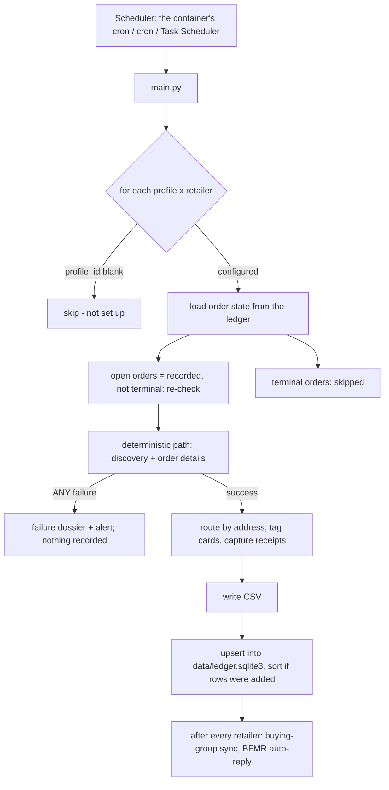
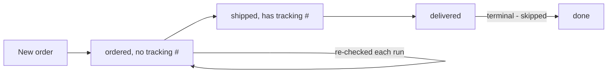

# Architecture

_Part of the [Buying Group Ledger](../README.md) docs._

How a run is shaped, why each retailer's path looks the way it does, and where the money goes.

## The Run Loop

Each run (`main.py`, under a run lock), for every configured profile × retailer: read the ledger to
decide what's new and what needs re-checking, fetch through that retailer's **deterministic path**,
and upsert the results. A failure writes a [failure dossier](diagnostics.md#failure-dossiers) and
records nothing for that retailer; there is no LLM fallback.

After routing, rows to a `Personal` address are dropped, the card and cashback rate are resolved
(spend caps included), and receipts are captured. The upsert re-derives capped cashback rates on
rows past shipped. The buying-group sync runs after every retailer, even if all of them failed,
because it also submits tracking for rows from earlier runs. Every step records what it did in the
[activity log](diagnostics.md#the-activity-log).

## The Four Deterministic Paths

**No browser runs locally.** Playwright is only a CDP *client* to a Browser-Use cloud browser, which
is why this runs on a Raspberry Pi.

| Retailer | Primary path | Why it's shaped that way |
|---|---|---|
| **Costco** | Private GraphQL API over `curl_cffi` with a stored refresh token | No browser at all. TLS impersonation passes Costco's fingerprint check. |
| **Best Buy** | Cloud CDP browser → in-page `fetch` of `/profile/ss/api/v1/orders/<id>` | The endpoint is Akamai-guarded, so the read rides the logged-in session from inside the page. |
| **Amazon** | CDP browser parsing server-rendered order-details HTML, then the package-tracking page | There is no order JSON to read. The tracking number lives only on the tracking page. |
| **Amazon Business** | Same parser; its own discovery and click-through pagination | A separate scraper, so it can't regress the consumer one. |

Details per retailer: [Retailers](retailers.md).

## Cost Model

A normal run spends no LLM tokens: every read is a deterministic fetch through a cloud CDP browser
or a direct API call. What costs money is cloud-browser time (Browser-Use) and, with the sync on,
BFMR insurance premiums (see [Buying groups](buying-groups.md)).

The paid Browser-Use agent fallback has been removed. A broken selector is fixed from the failure
dossier: the alert names it, and its captured page becomes the test fixture that proves the fix
offline.

A REST tracking API (17TRACK, EasyPost) was evaluated and **rejected**. Each deterministic path
already reads `shipped → delivered` for free, and those APIs cover Amazon Logistics `TBA…` numbers
worst.

## A Shipment's Lifecycle

An order is terminal only once **every** one of its shipment rows is terminal, so a split order stays
open until the last box lands. Terminal orders drop out of later runs, so a growing ledger doesn't
make every run slower. `paid` and `return` come later from the buying groups
([Data model](data-model.md)).

## Concepts

- **Profile**: a Browser-Use cloud browser identity (a `config.json` `profiles` entry) with its own
  static ISP proxy and the retailers it's signed into. One profile can cover several retailers
  ([Profiles and sign-in](profiles-and-auth.md)).
- **Ledger**: `data/ledger.sqlite3`, the source of truth. Every writer and reader goes through the
  worksheet-faced adapter in `ledger_db/` ([Data model](data-model.md)).
- **Dashboard**: `web/` (`python -m web`), the ledger's UI: Overview, Orders, Activity, Audit,
  Recon, Taxes, Tools and Settings. In Docker it runs in the same container as the scheduler
  ([Operations](operations.md#the-web-dashboard)).
- **Alerts**: Gmail and a Discord webhook, each with its own switch, fired on signed-out sessions,
  run failures and dossiers.
