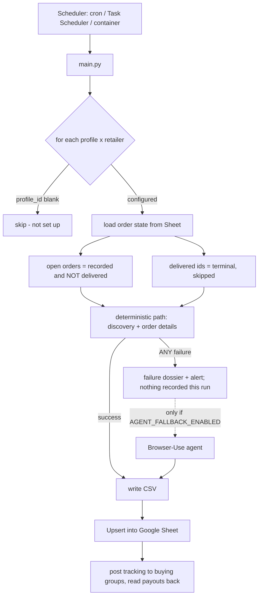
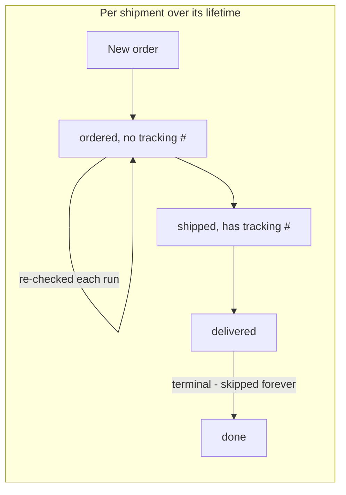

# Architecture

_Part of the [Buying Group Ledger](../README.md) docs._

How a run is shaped, why each retailer's path looks the way it does, and where the money goes.

## The run loop

Each run, for every configured profile × retailer: read the Sheet to decide what's new versus what
needs re-checking, fetch through that retailer's **deterministic path**, and upsert the results back.
The LLM agent enters only when the deterministic path raises.




## The four deterministic paths

**No browser runs locally on any of them** — Playwright is used only as a CDP *client* to a cloud
browser, which is why this runs happily on a Raspberry Pi.

| Retailer | Primary path | Why it's shaped that way |
|---|---|---|
| **Costco** | Private GraphQL API over `curl_cffi` with a stored refresh token | No browser at all. Needs TLS impersonation to pass Costco's fingerprint check. |
| **Best Buy** | Cloud CDP browser → in-page `fetch` of `/profile/ss/api/v1/orders/<id>` | The endpoint is Akamai-guarded, so the read rides the logged-in session cookie *from inside the page* rather than replaying it out-of-band. |
| **Amazon** | CDP browser parsing server-rendered order-details HTML, then a hop to the package-tracking page | A network capture proved there is no order JSON to read — every JSON response was telemetry or recommendation carousels. The tracking number lives only on a separate page. |
| **Amazon Business** | Same parser; its own discovery and click-through pagination | Order details are identical to consumer Amazon; only discovery and pagination diverge, so it's a separate scraper that can't regress the consumer one. |


## Cost model

Browser-Use bills mostly by **input tokens** — every agent step ships the whole page to the model, so
cost is step-count × per-step page context. That makes the agent the expensive component, and is the
reason the deterministic paths exist: a normal run now spends no tokens at all.

**The agent is off by default** (`AGENT_FALLBACK_ENABLED=false`, since 2026-08-29). Once every
retailer's deterministic path had been live-validated, the agent fallback had become a per-failure
tax that *hid what broke*: a layout change produced a paid run and a row, not a fix. Now a
deterministic-path failure produces a **failure dossier** instead:

```
logs/failures/<retailer>_<profile>_<timestamp>/
  report.md       exception + traceback, a timeline of what the path was doing, and a SELECTOR
                  AUDIT: every selector the parser depends on, how many matches it got on the
                  captured page, and a sample of the text — a 0 where there used to be a hit is
                  the fix
  page_N.html     the DOM at the moment of failure (secrets + common PII patterns redacted)
  page_N.png      what it looked like
  response_N.txt  the API request/response, for the no-browser paths (Costco GraphQL)
```

The alert names the dossier path. Hand the directory to a coding agent with the retailer's
`_mapping.py` / `_api.py`; the captured HTML becomes the test fixture that proves the fix offline.
Nothing is recorded for that retailer that run, and the next scheduled run retries. A scrape that
*succeeds* but could not read part of a page (a tracking page whose selectors stopped matching, an
order-details page that failed to load) also leaves a dossier and alerts, because those used to be
silent. Login failures never ran the agent and still don't; their alerts now point at a dossier too.

Set `AGENT_FALLBACK_ENABLED=true` (or a retailer's `*_FORCE_AGENT` hook, which is an explicit request
to spend) to restore the old behaviour: the dossier is still written, then the agent runs — one call
per profile covering both jobs, scan for new orders (JOB 1) and re-check open ones (JOB 2). Pinning
the exact click path through Best Buy's sign-in flow (instead of letting the agent screenshot its way
to the password field) took a representative run from 3.35M to 932K tokens and $0.128 to $0.053.

**A shipment's lifecycle:**



An order is terminal only once **every** one of its shipment rows is delivered, so a split order stays
open until the last box lands. Terminal orders drop out of later runs entirely — which is what stops a
growing ledger from making every run slower and more expensive.

A **REST tracking API** tier (17TRACK, EasyPost) was evaluated as a cheaper delivery-watch and
**rejected**. Now that every retailer has a deterministic path, `shipped → delivered` already comes
free in the read being done anyway, so a per-shipment fee would buy a signal that's already there —
and the coverage it's weakest at, Amazon Logistics `TBA…` numbers, is the one gap it would have had to
fill. Its only real edge, real-time webhooks, doesn't matter against a multi-hour poll.


## Concepts

- **Profile** = a Browser-Use cloud browser identity (a `config.json` `profiles` entry) with its own **static ISP
  proxy** and the set of **retailers** it's logged into. One profile can cover several retailers.
- **Sheet** = the source of truth. Each run reads it to decide what's new vs. what needs a re-check,
  and writes results back.
- **Alerts** = email (Gmail SMTP) + Discord webhook, fired on logged-out sessions and run failures.
